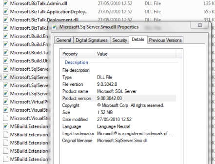
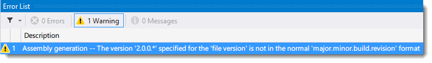

 
**Figure: Keep these two versions consistent** If you are not using the GAC, it is important to keep AssemblyVersion, AssemblyFileVersion and AssemblyInformationalVersionAttribute the same, otherwise it can lead to support and maintenance nightmares. By default these version values are defined in the AssemblyInfo file. In the following examples, the first line is the version of the assembly and the second line is the actual version display in file properties.

<!--endintro-->


```
[assembly: AssemblyVersion("2.0.0.*")]
 [assembly: AssemblyFileVersion("2.0.0.*")]
 [assembly: AssemblyInformationalVersion("2.0.0.*")]
```


::: bad
Bad example - AssemblyFileVersion and AssemblyInformationalVersion don't support the asterisk (\*) character  
:::

If you use an asterisk in the AssemblyVersion, the version will be generated as described in the [MSDN documentation](https://msdn.microsoft.com/en-us/library/system.reflection.assemblyversionattribute%28v=vs.110%29.aspx) . If you use an asterisk in the AssemblyFileVersion, you will see a warning, and the asterisk will be replaced with zeroes. If you use an asterisk in the AssemblyInformationVersion, the asterisk will be stored, as this version property is stored as a string.Figure: Warning when you use an asterisk in the AssemblyFileVersion


```
[assembly: AssemblyVersion("2.0.*")]
 [assembly: AssemblyFileVersion("2.0.1.1")]
 [assembly: AssemblyInformationalVersion("2.0")]
```


::: good
Good example - MSBuild will automatically set the Assembly version on build (when not using the GAC)  
:::

Having MSBuild or Visual Studio automatically set the AssemblyVersion on build can be useful if you don't have a build server configured.

If you are using the GAC, you should adopt a single AssemblyVersion and AssemblyInformationalVersionAttribute and update the AssemblyFileVerison with each build.


```
[assembly: AssemblyVersion("2.0.0.0")]
 [assembly: AssemblyFileVersion("2.0.0.1")]
 [assembly: AssemblyInformationalVersion("My Product 2015 Professional")]
```


::: good
Good example - the best way for Assembly versioning (when using the GAC)  
:::

If you're working with SharePoint farm solutions (2007, 2010, or 2013), in most circumstances the assemblies in your SharePoint WSPs will be deployed to the GAC. For this reason development is much easier if you don't change your AssemblyVersion, and increment your AssemblyFileVersion instead.

The AssemblyInformationalVersion stores the product name as marketed to consumers. For example for Microsoft Office, this would be "Microsoft Office 2013", while the AssemblyVersion would be 15.0.0.0, and the AssemblyFileVersion is incremented as patches and updates are released.

Note: It would be good if Microsoft changed the default behaviour of AssemblyInformationalVersionAttribute to default to the AssemblyVersion. [See Mikes suggestion for improving the version number in the comments here.](http://msdn.microsoft.com/en-us/library/system.reflection.assemblyinformationalversionattribute.aspx)
