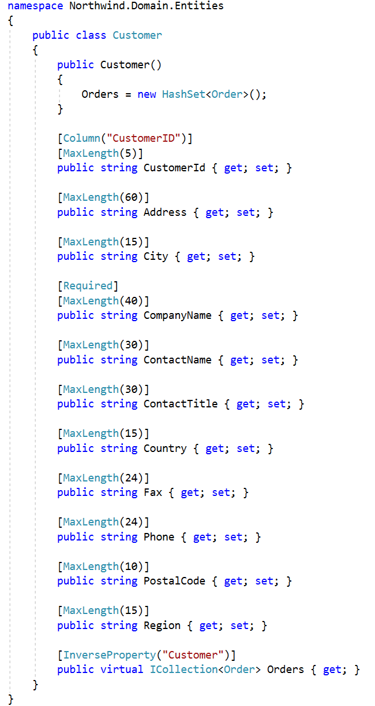
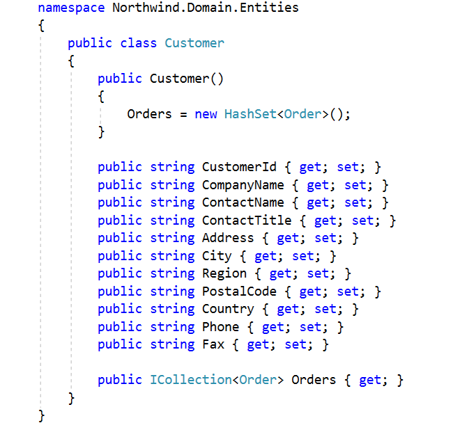

​The domain layer should be independent of data access concerns. The domain layer should only change when something within the domain changes, not when the data access technology changes. Doing so ensures that the system will be easier to maintain well into the futur​e since changes to data access technologies won't impact the domain, and vice versa. 

This is often a problem when building systems that leverage Entity Framework, as it's common for data annotations to be added to the domain model. Data annotations, such as the Required or MinLength attributes, support validation and help Entity Framework to map objects into the relational model. In the next example, data annotations are used within the domain model: 

 <excerpt class='endintro'></excerpt> 
<dl class="badImage"><dt>​</dt><dd>Bad Example: Domain is cluttered with data annotations</dd></dl>
As you can see in the above example, the domain is cluttered with data annotations. If the data access technology changes, we will likely need to change all entities as all entities will have data annotations. In the following example, we will remove the data annotations from the entity and instead use a special configuration type:
<dl class="goodImage"><dt>
         
      </dt><dt>
         
      </dt><dd>Good Example: Domain is lean, configuration for entity is contained within a separate configuration type</dd></dl>
This is a big improvement! Now the customer entity is lean, and the configuration can be added to the persistence layer, completely separate of the domain. Now the domain is independent of data access concerns.

Learn more about this approach by reading about 
      <a href="https://docs.microsoft.com/en-us/ef/core/what-is-new/ef-core-2.0%22%20%5cl%20%22self-contained-type-configuration-for-code-first">self-contained configuration for code first</a>.​ 

 

 

<strong>Figure: ​Database implementation is a Infrastructure concern not a Domain concern. ​​</strong><strong></strong> 

