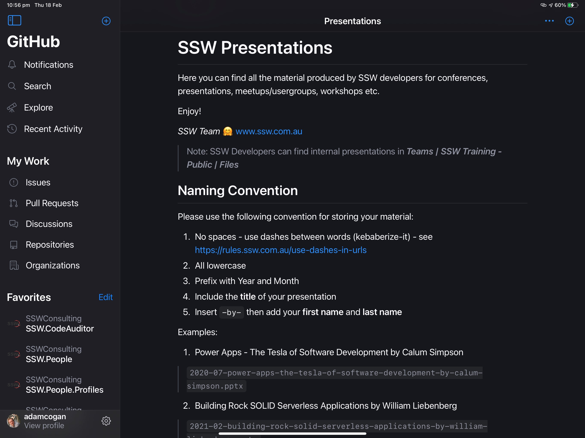

Most companies keep their presentations on an internal resource (e.g. SharePoint, or these days more likely "Teams | Files") and there is still a place for that (especially if you don't want to share it).

The best place for presentations (PPT) and other resources such as PDFs or a bunch of URLs is in a public location. The best public location is GitHub.

Did you know that if you keep your PowerPoint presentations in a public location, it makes it easier for your attendees to access later?

<!--endintro-->

There are a few ways to do this:

- **Option 1:** GitHub (E.g. [github.com/sswconsulting/presentations](https://github.com/sswconsulting/presentations)) Recommended! ⭐️
- **Option 2:** [Slideshare](http://slideshare.net/)  
  SlideShare is an online service for uploading files privately or publicly in PowerPoint, Word, PDF files. Content can then be viewed on web and mobile devices or embedded on other sites.
- **Option 3:** [Notist](https://noti.st/)  
  A design & video collaboration, prototyping & workflow app for creative teams.
- **Option 4:** Sharing a OneDrive link (⚠️ They expire!)
- **Option 5:** [Google Slides](https://www.google.com/slides/about/)  
  A Google powered service which can create, present, and collaborate on online presentations in real-time and from any device.
- **Option 6:** [Tencent Doc](https://docs.qq.com/home/product#ppt)  
  A famous free online document platform that allows for multi-person collaboration of Word, Excel, and PPT documents. Recommended for user from China️!🇨🇳

::: good

:::
