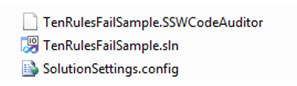

Finding a file with a BAK extension is a "call sign" that your folders need a tidy up.
 <excerpt class='endintro'></excerpt> 
<dl class="badImage"><dt>
      
   </dt><dd>Figure: Bad example</dd></dl><dl class="goodImage"><dt>
      
   </dt><dd>Figure: Good example​</dd></dl>
We have a program called 
   <a href="http://www.ssw.com.au/ssw/CodeAuditor">SSW Code Auditor</a> to check for this rule.​
​

