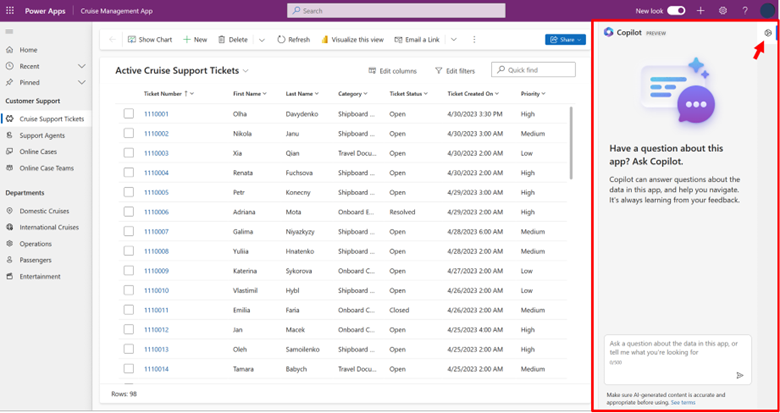
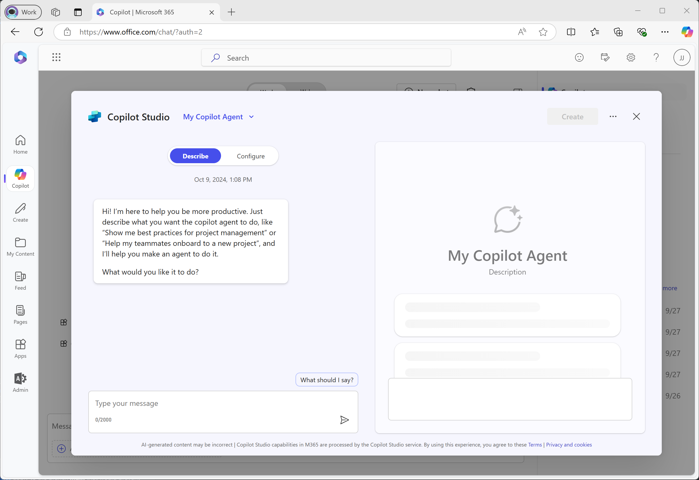
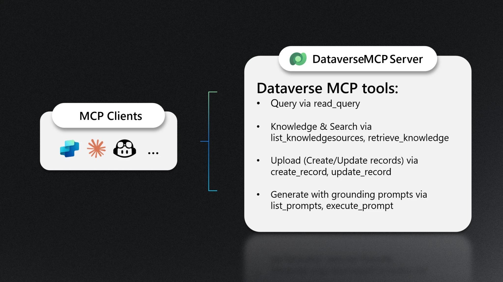

Want to supercharge your business with Dataverse AI integration? This guide pulls together proven strategies and practical recommendations to help your organization maximize the latest Copilot, Copilot Studio agents, and Model Context Protocol (MCP) innovations for Dataverse.

<!--endintro-->

## Are you ready to get the most from AI in Dataverse?

The Dataverse ecosystem now offers advanced built-in AI tools—but not every feature is worth your team’s time, and some can introduce risks if not adopted wisely. Read on for the essentials.

***

## Copilot in Dataverse

⭐ = Recommended
💲 = Paid (most enterprise features)

* **Get answers instantly:** Use Copilot for Dataverse to query, summarize, and update data using natural language—no need for custom Power Automate flows or manual exports. Let Copilot turn questions into actions, boosting user productivity.
* **Train your staff:** Make sure team members get prompt engineering basics. “Show me open cases assigned to Jane” works better than vague instructions.
* **Validate responses:** Copilot is excellent for summarizing records or generating communications, but always review its suggestions—especially before sharing with clients or acting on sensitive business info.

More information: <https://learn.microsoft.com/en-us/power-apps/maker/model-driven-apps/add-ai-copilot>

::: img-large

:::

***

## Copilot Studio Agents

* **Automate with purpose:** Copilot Studio lets teams build powerful, reusable agents for Dataverse and beyond. Always define the business problem first—avoid spinning up agents without a clear outcome.
* **Integrate via MCP:** Use Model Context Protocol (MCP) to connect agents with your Dataverse tables, business logic, and external APIs. MCP is the new standard, making future updates and integrations easier and more robust.
* **Iterate fast:** Gather user feedback on agent outputs, keep logs, and refine your agents in small weekly sprints. AI agents should evolve—don’t treat them as one-off deployments.

More information: <https://learn.microsoft.com/en-us/microsoft-365-copilot/extensibility/copilot-studio-lite>

::: img-large

:::

***

## Model Context Protocol (MCP)

⭐ = Recommended

* **Standardize your connections:** MCP is rapidly becoming the “USB of AI”—standardizing how Copilot, Copilot Studio agents, and third-party assistants talk to your Dataverse and other business data. With MCP, integrations require less custom code and scale better as new AI tools emerge.
* **Guard your endpoints:** Only expose the minimum necessary tables and records over MCP. Always apply Dataverse security roles and audit logs so all AI access is trackable and compliant.
* **Keep good documentation:** Document each MCP link—including purpose, permissions, and owner—for fast troubleshooting when change requests or compliance needs arise.

More information: <https://learn.microsoft.com/en-us/power-apps/maker/data-platform/data-platform-mcp>

::: img-large

:::

***

## Responsible and Transparent AI Use

* **Indicate when AI helps:** If Copilot or agents have shaped significant outputs, make it visible. Use the 🤖 emoji in internal docs, or a brief disclosure for client-facing materials. This simple habit builds trust and encourages responsible adoption.
* **Review for bias and privacy:** Regularly check that Copilot or agents don’t accidentally expose sensitive data or amplify bias. Run quick audits of sample outputs and permissions.
* **Fact-check everything important:** If you’re making big decisions based on Copilot suggestions—like reporting on sales figures or forecasting revenue—always double check with authoritative Dataverse views or manual queries.
* **Monitor system changes:** Set up real-time logging and alerts for all AI-driven updates, so any mistakes or anomalies can be caught quickly.

***

## Security and Compliance

* **Use least privilege for agents:** Never give Copilot Studio agents more permission than they need. Apply Dataverse security best practices—role-based access, strong auth, least privilege—and review access monthly.
* **Stay legal:** Make sure all AI interactions comply with your local privacy rules (GDPR, HIPAA) and with Microsoft’s licensing—especially if integrating external models or data.
* **Audit endpoints:** Maintain regular audits on both security and usage—who accessed what, when, and why? Automated dashboards (Power BI, Teams notifications) can help surface any issues before they become problems.

***

## Keep Your Team AI-Smart

* **Run weekly meetings:** AI tools change fast. Keep teams sharp by running short, regular check-ins on new Copilot features, agent upgrades, or MCP integrations. Share success stories—and warn about common pitfalls.
* **Centralize your AI knowledge:** Maintain a Dataverse table, Wiki, or SharePoint site listing every AI agent, Copilot use-case, and MCP link in play across your organization. This stops wasted effort and helps new projects build on what’s working.

***

## In conclusion…

Dataverse is now an AI-enabled platform. By using these up-to-date rules—always choose the right tool for the job, connect smartly with MCP, and stay vigilant on privacy and compliance—your organization will be ready for a new era of data-driven, AI-powered business processes.
