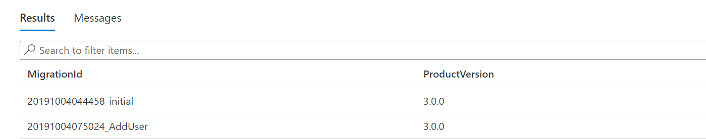
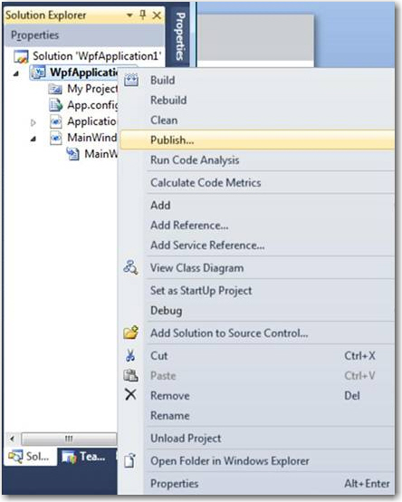

You have worked hard on the coding, got a "Test Pass" from the testers. Great! Now you have approval to deploy to production. Let's see some ways that allow for easy deployments.

<!--endintro-->

### Modern Projects 

If you are using Entity Framework Code First migrations this can be handled within your pipeline. 

::: good
 
:::

### Legacy Projects

With Visual Studio, deployment becomes easier and easier, you can choose different ways for different kinds of projects.

**Web Clients**

* Right-click "Publish" (recommended if you can directly connect)  
OR
* Right-click "Create Package"  

**Rich Clients**

* Right-click "Publish" (recommended if you can use ClickOnce)   
OR
* Right-click "Create Setup" (Suggestion to Microsoft as menu doesn't exist)

**Database**
            

Now all this works beautifully first time, when there is no existing database... and no existing data to worry about. Now you have a reason to read the rest of the rules :-)
