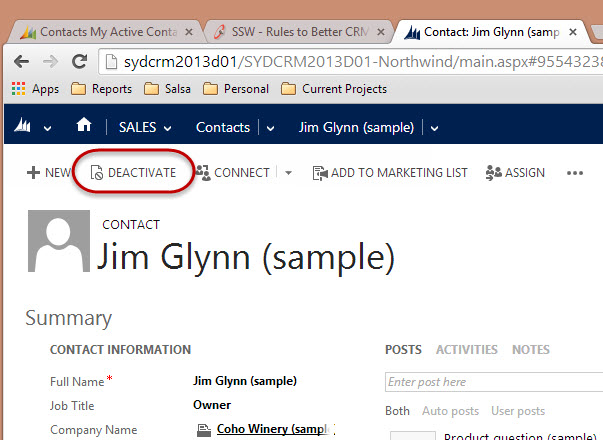

There comes a time when some contacts in your CRM database might just be taking up space and not giving any value. At this point it is best to deactivate them.
 <excerpt class='endintro'></excerpt> 
<ul>
          <li>CRM still knows about it so it will still come up for duplicate detection.</li>
          <li>You can still view them if you need to by viewing Inactive companies/contacts.</li>
        </ul>
        

          <b>Hint:</b> When you deactivate a client - put a note in the notes field to say
          why first.

 
<dd class="ssw15-rteElement-FigureNormal">​​​​​Figure: Once a contact moves on or their details are no longer relevant, deactivate them </dd>

