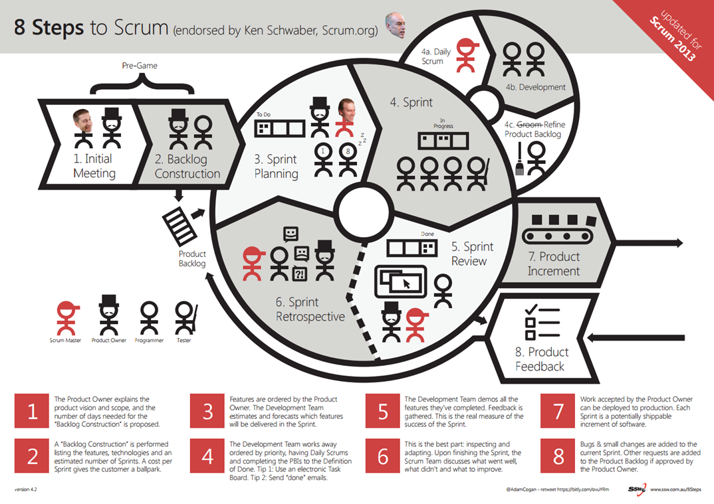
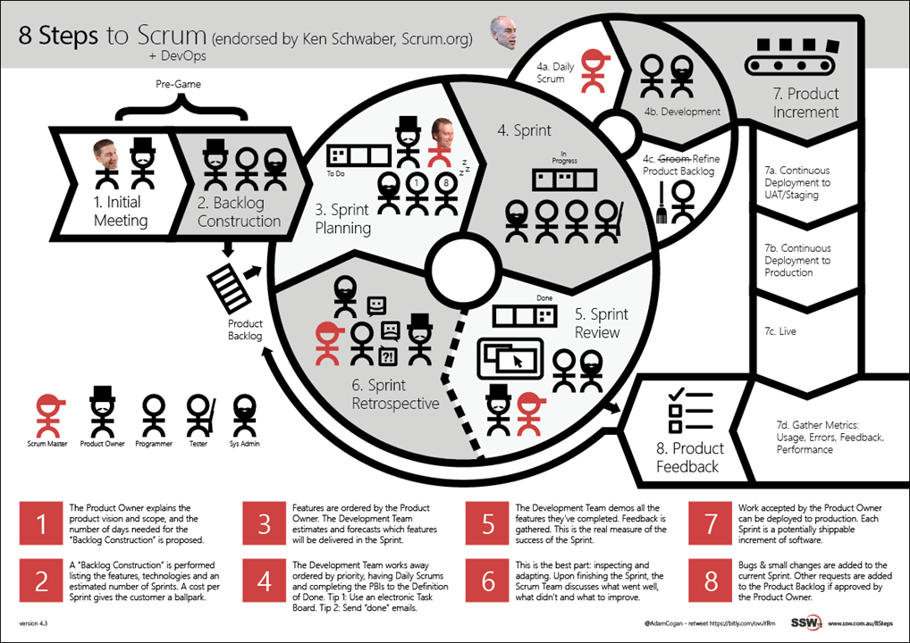

DevOps and Scrum compliment each other very well. Scrum is about inspecting and adapting with the help of the Scrum ceremonies (Standup, Review, Planning and Retro). With DevOps it's all about Building, Measuring and Improving with the help of tools and automation. <dl class="image"><dt></dt><dd>Figure: Traditional Scrum Process</dd></dl><dl class="goodImage"><dt> </dt><dd>Figure: Scrum with DevOps </dd></dl>
With DevOps, we add tools to help us automate slow process like build and deployment then add metrics to give us numbers to help quantify our processes. Then we gather the metrics and figure out what can be done to improve.  

 <excerpt class='endintro'></excerpt> 

​​For example with Exception Handling, you may be using a tool like <a href="/_layouts/15/FIXUPREDIRECT.ASPX?WebId=3dfc0e07-e23a-4cbb-aac2-e778b71166a2&TermSetId=07da3ddf-0924-4cd2-a6d4-a4809ae20160&TermId=0523c65b-2fe6-4e7b-a232-0fc3c9440447">Raygun.io​</a> or Elmah and have 100s of errors logged in them. So what do you do with these errors? You can: 
<ol><li>Add each one to your backlog </li><li>Add a task to each sprint to "Get exceptions to 0"​​​</li></ol>

The problem with the above is that not all exceptions are equal, and most of the time they are not more important than the planned PBIs being worked on. No developers like working a whole sprint just looking at exceptions. What should happen is:
<ol><li>Have the exceptions visible in your development process (i.e. using Slack, adding as something to check before Sprint Planning) </li><li>Triage the exceptions, either add them to the backlog if they are urgent and important </li><li>Add ignore filters to the exception logging tool to ignore errors you don't care about (e.g. 404s) </li><li>Prioritize the exceptions on the backlog</li></ol>
​The goal here is to make sure you're not missing important and to reduce the noise. You want these tools to help support your efforts and make your more productive and not just be another time sink.

