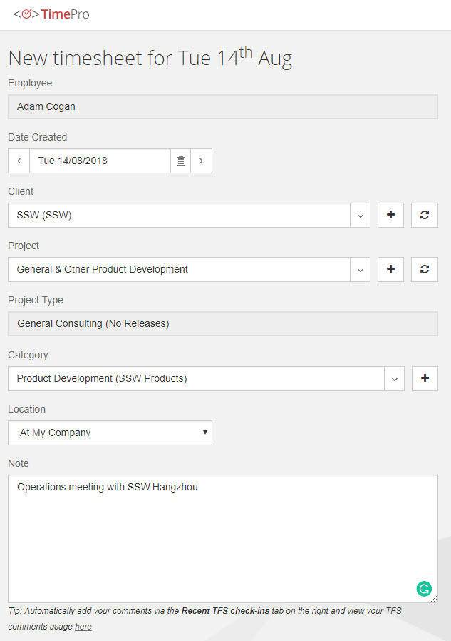
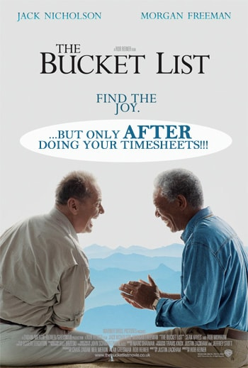

**Timesheets are the lifeblood of the company** and are the ultimate source of everyone's income.

<!--endintro-->

Timesheets should be right near the top of your priorities. It's #2 on [Do you get your work done in order of importance (aka priorities)?](/do-you-complete-work-in-order-of-importance-aka-priorities)

  

