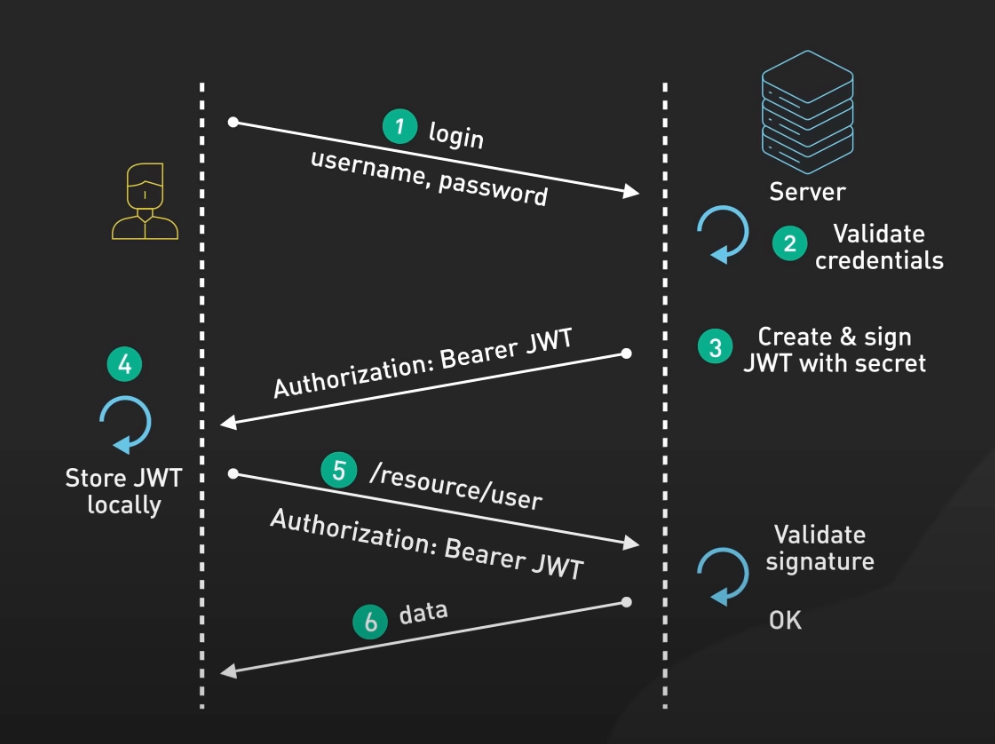

# Do you know how Modern Stateless Authentication works?

Modern stateless authentication, particularly through JSON Web Tokens (JWT), is a widely adopted method in web development for managing user sessions and securing applications. Unlike traditional session-based authentication, JWT allows for a more scalable and efficient approach by avoiding server-side storage of user session information.

This new approach to authentication often utilizes the OpenID Connect (OIDC) authentication flow, which is an authentication layer built on top of OAuth 2.0. This protocol extends OAuth 2.0 by adding an ID token, which is a JSON Web Token (JWT) that contains information about the end-user

A JWT is a base64-encoded JSON object that is digitally signed and optionally encrypted. It consists of three parts: a header, a payload, and a signature. The header contains metadata about the token, such as the type and the signing algorithm. The payload contains claims, which are statements about the user and additional data. The signature is used to verify the integrity of the token and to ensure that it has not been tampered with.

The process of stateless authentication usually involves trusting a ExternalAuthProvider outside  your application to authenticate users and then using a token issued by them to identify the user in your application. An ExternalAuthProvider can be a service like Azure AD, IdentityServer, or any other OAuth2 or OpenID Connect provider.

{{insert video here...}}
<!--endintro-->

### The Process of Stateless Authentication with JWT

#### User Authentication

* The user submits their credentials (username and password) to the ExternalAuthProvider.
* Upon successful authentication, the provider generates a JWT, which includes claims about the user and is signed with a secure key.
* The JWT is then returned to the client application, usually via an HTTP response.

#### Token Storage

* The client application receives the JWT and stores it securely, often in the browser's local storage or an HttpOnly cookie to prevent access from JavaScript and reduce the risk of cross-site scripting (XSS) attacks.

#### Authorized Access

* For subsequent requests to your resource avaibale at your application backend server, the client includes the JWT in the request headers as a Bearer token.
* The server, upon receiving a request with a JWT, verifies the token's signature and the validity of its claims against an authority which in this case is the ExternalAuthProivder.
* If the token is valid, the server grants access to the requested resource which in most cases is an API.

#### Token Expiry and Refresh Mechanism

* JWTs typically have an expiration time set by the server. Once expired, the user must re-authenticate to obtain a new token.
* Often, a refresh token mechanism is employed, where a longer-lived refresh token is issued alongside the JWT. The refresh token can be used to sliently obtain new access tokens without requiring the user to re-authenticate, enhancing the user experience while maintaining security.

### Benefits of JWT in Stateless Authentication

* **Scalability:** As the ExternalAuthProvider doesn't store session data, it can easily handle requests from a large number of users without a significant impact on performance.
* **Flexibility:** JWTs can be used across different domains and in various architectures, such as microservices, making them suitable for modern, distributed applications.
* **Performance:** Carrying relevant user information within tokens can reduce database queries, improving the overall performance of the application.

### Security Considerations for JWT Authentication

Proper security measures are essential in handling JWTs to prevent unauthorized access and breaches:

* **Sensitive Information**: Avoid storing sensitive data in JWT payloads as they are not encrypted and can be exposed to unauthorized parties.
* **Secure Storage**: Prefer HttpOnly cookies over local storage for JWTs to mitigate the risk of Cross-Site Scripting (XSS) attacks. HttpOnly cookies enhance security by restricting access to tokens via JavaScript.
* **Token Expiry**: Implement short-lived JWTs to reduce the risk window in case of token compromise. Short expiration times necessitate more frequent token renewal, enhancing security.
* **Transmission Security**: Use HTTPS to ensure encrypted communication between client and server, protecting token data during transit.
* **Validation and Revocation**: Validate JWTs on each request to verify their integrity and authenticity. Consider token revocation mechanisms for additional security, such as maintaining a list of invalidated tokens.

Adopting these practices helps maintain the integrity of JWT-based authentication and protects against potential security threats.

Understanding and implementing modern stateless authentication with JWTs is crucial for developing secure and scalable web applications. By following the best practices for token management and security, developers can build robust authentication systems that cater to the needs of modern web applications.

For more insights and technical implementations, consider exploring additional resources such as Auth0's guide on [Stateless Sessions for Stateful Minds](https://auth0.com/blog/stateless-sessions-for-stateful-minds-jwts-explained/) and LogRocket's blog on [JWT authentication best practices](https://blog.logrocket.com/jwt-authentication-best-practices/).
