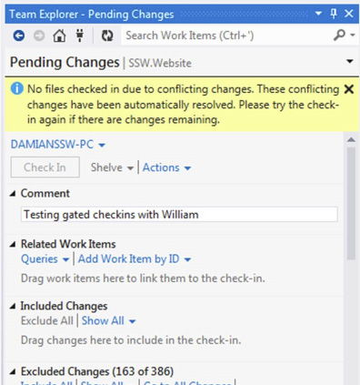
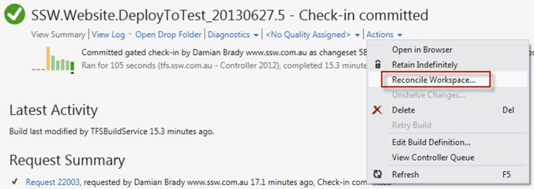
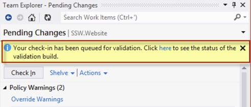
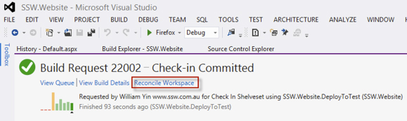

Gated Checkins are great for verifying your project builds successfully before a checkin occurs, but the workflow and dialog messages can be difficult to follow.  Sometimes it’s not clear what you need to do next as a developer.   
<!--endintro-->

The process for a project with a Gated Checkin build is:

1. The developer clicks         **Check In**
2. Changes are not checked in, but are shelved and a build is queued
3. The developer is notified when a build succeeds and prompted to “Reconcile” their workspace

**Note:** This relies on the      **Build Notifications** tool running, which may not be the case.  If it’s not running, the developer has to manually reconcile their workspace before they can effectively continue working.
<dl class="image">&lt;dt&gt;
      
   &lt;/dt&gt;<dd>Figure: The developer is notified if a gated check-in resulted in a commit</dd></dl>
If you don't have the      **Build Notifications** tool running or you click      **Ignore** , you will have to manually reconcile. There are a few ways to do this.

You can click      **Check In** again.  This will fail, but any files you’re trying to check in will be reconciled as a result.  You should definitely not do this if you’ve made additional changes since checking in.
<dl class="badImage">&lt;dt&gt;
      
   &lt;/dt&gt;<dd>Figure: Bad Example - Reconcile by clicking "Check In" again.  This will fail, but any files you're trying to check in will be reconciled.</dd></dl>
Alternatively, you can open the queued build and choose      **Actions | Reconcile Workspace...** to fix your workspace
<dl class="goodImage">&lt;dt&gt;
      
   &lt;/dt&gt;<dd>Figure: OK Example – Open the Build and choose Actions | Reconcile Workspace...</dd></dl>
The best way is to click the link in the notification to open a specific build window with a      **Reconcile Workspace** link included.
**Note:** This notification will disappear if you close it or navigate away from the      **Pending Changes** window in      **Team Explorer** .
<dl class="goodImage">&lt;dt&gt;
      
   &lt;/dt&gt;<dd>Figure: Good Example #1 – Click the link in the notification after clicking Check In</dd></dl><dl class="goodImage">&lt;dt&gt;
      
   &lt;/dt&gt;<dd>Figure: Good Example #2 – Click on the link in the notification to open the build, then click Reconcile Workspace when the build finishes</dd></dl>
Read our suggestion to Microsoft on how to[improve the Gated Checkin workflow](http://www.ssw.com.au/ssw/standards/BetterSoftwareSuggestions/TeamFoundationServer.aspx#improve-gated-checkin).
