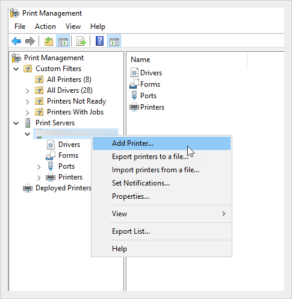
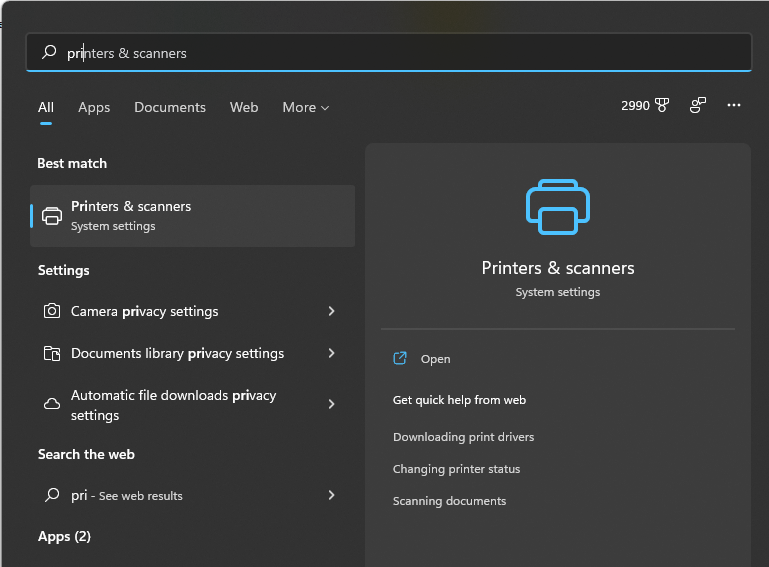

When you are connected to the company's network, you should complete the following procedure if you want to setup a printer server.

<!--endintro-->

**For Windows OS:**

##### Steps to add a printer to Active Directory

1. In run | type "printmanagement.msc" | enter
2. Right-click 'Print Server' | Choose Add/Remove Servers | Add IP address or computer name\
   or
3. Right click the 'Print Server' | Add printer | Choose the best option (e.g TCP/IP) | Put the IP address of the Printer | Finish

4. Add DNS entry for your print server (e.g \printer) to make it friendly for the users to find.

Now your users can find the printers by doing the following:

1. In the File explorer | type **\printer** on the address bar to show all the printers connected to the server.

:::bad

:::

::: good

:::

2. Double click on your printer name to connect/add it. Follow prompt to finish the printer driver installation.