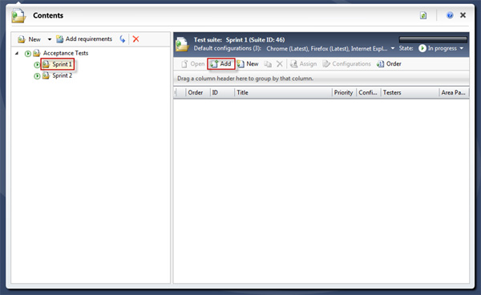
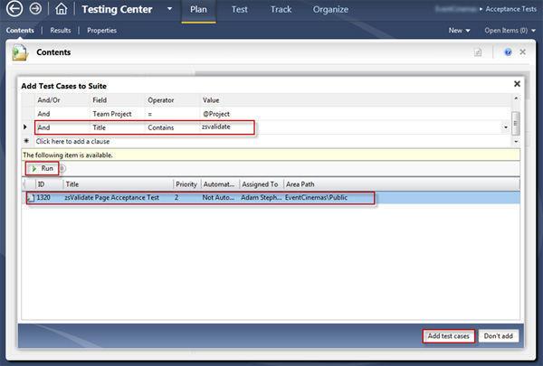
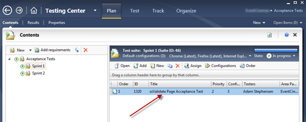

You organize your Test Cases by adding them to a Test Plan (also called a Test Suite).

<!--endintro-->

We have one Test Plan per sprint.
**Figure: Select Plan from the main menu, and then choose the Test Plan that you would like to add Test Cases to** **Figure: Add a filter to make it easy to find your Test Cases. Click the Run button, select the relevant items and click the 'Add Test Cases' button** **Figure: Your Test Case has now been added to the suite**
