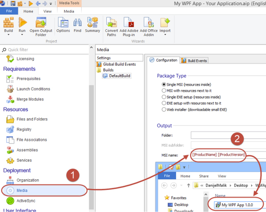

​Developers should add a version number at the end of the out package. E.g. SSWCodeAuditor_v14.0.0.exe

Here is how you do it in Advanced Installer:

 <excerpt class='endintro'></excerpt> 
<ol class="ol1"><li class="li1">​In the navigation pane look for 
      <strong>Media</strong></li><li class="li1">Choose 
      <strong>Configuration</strong> tab and click in 
      <strong>MSI name</strong> text box which is located under 
      <strong>Output</strong> section</li><li class="li1">Next to the text add 
      [|ProductVersion]. If the text-box is empty you may want to start it with 
      [|ProductName]</li></ol><dl class="image"><dt></dt><dd>Figure​: Advanced Installer - Add version to output package</dd></dl>

