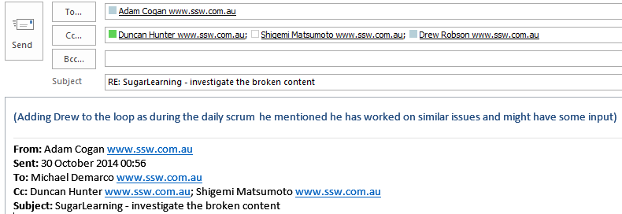
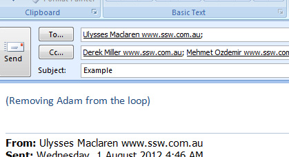
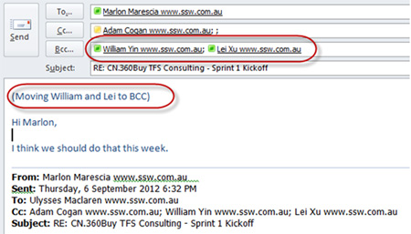

If you think someone should be involved in a conversation but they're not on the recipient list, all you need to do is "Reply All", put the new recipient in the 'CC' field and include one line at the top to inform people for clarity

 e.g. (Adding Drew)  

Be aware that it is easy to over CC people. Try not to CC people without thinking as every person added to a thread costs $$$. So when you add someone, it is a good idea to state the reason why they are being added, so it will justify the cost of their time.

 e.​g. (Adding Drew to the loop as during the daily scrum today he mentioned he has worked on similar issues and might have some input)
​ 
 <excerpt class='endintro'></excerpt> 
<dl class="goodImage"><dt></dt><dd>Figure: Good Example - Adding someone to an email thread</dd></dl>
If you need to remove someone from the loop, for example to have an internal conversation about an email to a client, put (Removing xxx from the loop) at the top of the email.
<dl class="goodImage"><dt>​ </dt><dd>Figure: Good Example – Removing someone from an email thread so you can talk about the them in private</dd></dl> 

You can delete people from an email thread, but what often happens is:
<ul><li>The people being dropped won’t know and won’t be able to say "I don't want to be dropped from this thread"</li><li>The people who added them in the 1st place don't know that they included unnecessary people</li><li>The others on the thread might not notice the change in email addresses</li></ul>
To fix all these issues, instead of deleting people from the email, you:
<ul><li>Move them to the BCC</li><li>On the top line of the body say "(moving George and Bob to BCC)"</li></ul><dl class="goodImage"><dt>​ </dt><dd>Figure: Good Example – Moving someone to BCC</dd></dl>
<strong style="font-weight:bold;">VIDEO</strong><b> </b>- <a href="https://www.youtube.com/watch?v=LAqRokqq4jI">Top 10+ Rules to Better Email Communication with Ulysses Maclaren</a> <b></b> 

