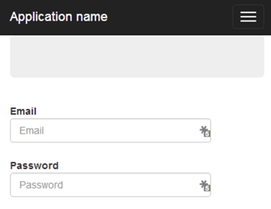

There are two ways of arranging labels and inputs on an html form, but each should be used in a specific scenario.

<!--endintro-->

When arranging labels and inputs on your html form, align labels next to the inputs on medium and large displays.

  

When arranging labels and inputs on your html form, align labels above inputs on small and extra-small displays.

  

Bootstrap makes this easy. Read [Do you use the css class "form horizontal" to arrange your fields and labels?](/do-you-use-the-css-class-form-horizontal-to-arrange-your-fields-and-labels) to know more.
