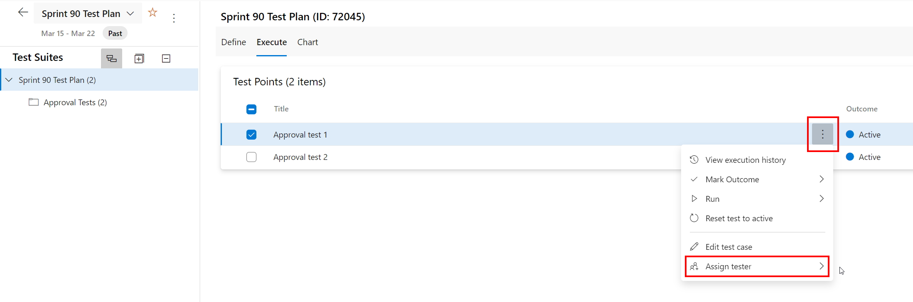

In Azure Test Plans, you can assign test cases for different configurations to be run by different testers.

<!--endintro-->

To assign a tester to run a test case for a configuration, select the Test Plan and go to the Execute tab, then assign the tester as shown below:

**Tip:** To assign a number of test cases to the same tester, multi-select the test cases (using the checkboxes) and then use the same steps as above.
