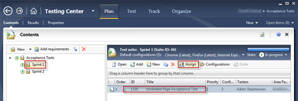
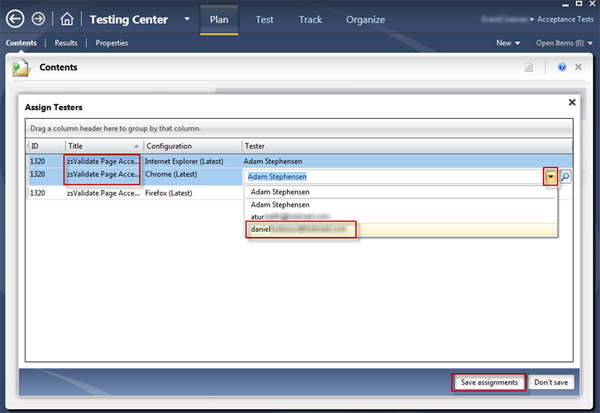

This is how assign a tester to test configurations:

 <excerpt class='endintro'></excerpt> 

Figure: From the Plan menu select the Test Plan, click on the Test Case and then click the Assign button

Figure: Select the rows to assign (Hold down [Ctrl] to select multiple), choose a tester from the available list and click on the Save Assignments button

