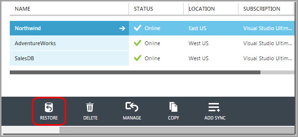

Microsoft Azure SQL Database has **built-in backups** to support self-service Point in Time Restore and Geo-Restore for Basic, Standard, and Premium service tiers.

<!--endintro-->

You should use the built-in automatic backup in Azure SQL Database versus using T-SQL.

::: greybox
T-SQL: CREATE DATABASE destination\_database\_nameAS COPY OF[source\_server\_name].source\_database\_name  
:::

::: bad
Figure: Bad example - Using T-SQL to restore your database  
:::

::: good  
  
:::

Azure SQL Database automatically creates backups of every active database using the following schedule: Full database backup once a week, differential database backups once a day, and transaction log backups every 5 minutes. The full and differential backups are replicated across regions to ensure the availability of the backups in the event of a disaster.

### Backup Storage

Backup storage is the storage associated with your automated database backups that are used for Point in Time Restore and Geo-Restore. Azure SQL Database provides up to 200% of your maximum provisioned database storage of backup storage at no additional cost.

| Service Tier | Geo-Restore | Self-Service Point in Time Restore | Backup Retention Period | Restore a Deleted Database |
| --- | --- | --- | --- | --- |
| Web | Not supported | Not supported | n/a | n/a |
| Business | Not supported | Not supported | n/a | n/a |
| Basic | Supported | Supported | 7 days | √ |
| Standard | Supported | Supported | 14 days | √ |
| Premium | Supported | Supported | 35 days | √ |

**Figure: All the modern SQL Azure Service Tiers support back up. Web and Business tiers are being retired and do not support backup. Check [Web and Business Edition Sunset FAQ](https://msdn.microsoft.com/en-us/library/azure/dn741330.aspx) for up-to-date retention periods** 

**Learn more on Microsoft documentation:**

- [Azure SQL Database Backup and Restore](https://msdn.microsoft.com/en-us/library/azure/jj650016.aspx)
- [Restore a SQL Database Using Point in Time Restore](https://azure.microsoft.com/en-ca/blog/azure-sql-database-point-in-time-restore/)

**Other ways to back up Azure SQL Database:**

* Microsoft Blog - [Different ways to Backup your Windows Azure SQL Database](https://daoudisamir.com/different-ways-backup-windows-azure-sql-database/)
