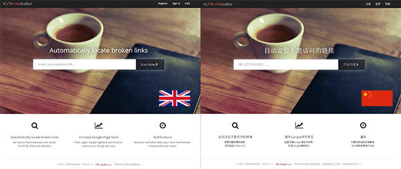

​​​​​Localization makes your web application ready to work more than one language — and it’s much easier if you do it from the beginning. Just follow these tips to better localize your application for a specific country or region.​
<dl class="ssw15-rteElement-ImageArea"></dl><dd class="ssw15-rteElement-FigureNormal">Figure: SSW LinkAuditor application is available in Chine​​se. </dd>
 <excerpt class='endintro'></excerpt> 
<ul class="p1"><li>
      ​Set your application default language to automatically change to local language. For more information see "<a href=/do-you-set-your-application-default-language-to-automatically-change-to-local-language>Set your application default language</a>".</li><li>Always give the user an option to change the locale and remember this choice for the future visits. For more information see "<a href=/do-you-always-give-the-user-an-option-to-change-the-locale>Always give the user an option to change the locale</a>".</li><li>Use client-side tools for localization as much as possible so that for the most part, the back end of your service remains unchanged. For more information see "<a href=/do-you-use-client-side-tools-for-localization-as-much-as-possible-2>Use client-side tools for localization as much as possible</a>".</li><li>
      Leave plenty of space for text expansion in other languages.</li><li>
      Do not hardcode strings, instead you should move strings to resource files. For more information see "<a href="https://www.jetbrains.com/resharper/features/internationalization.html">Localize .NET applications with ease</a>".</li><li>
      Localize the date/number format.</li><li>
      Avoid using images and icons that contain text in your application. They are difficult to localize.</li><li>
      Provide numerous comments in application resources that define context. For more information see "<a href=/do-you-provide-numerous-comments-in-application-resources-that-define-context>Provide numerous comments in application resources that define context</a>".</li><li>
      Get native speakers to test the application to make sure that the language reads properly and is true to the intent.</li><li>
      Make sure that your social media presence covers the countries you have translated your application into. For more information see "<a href=/do-you-follow-a-definition-of-social-media>Definition of implementing social media campaigns</a>"</li></ul>

