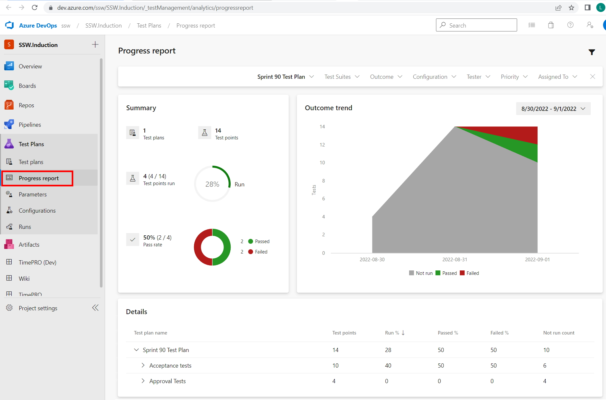
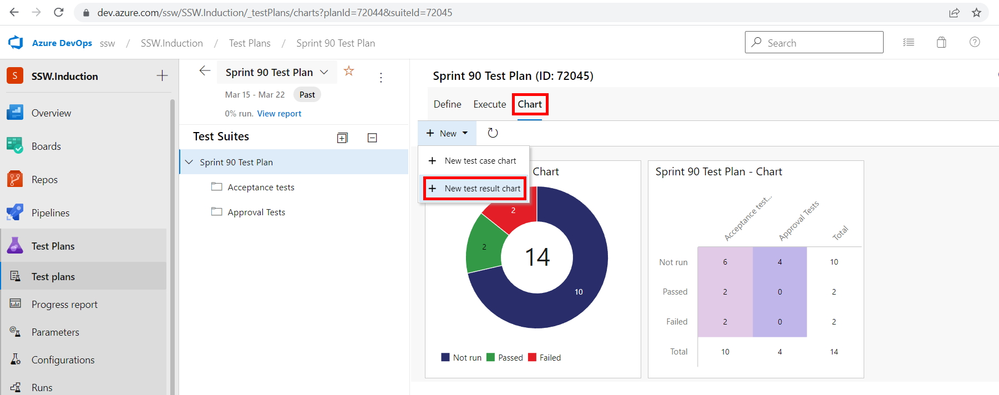
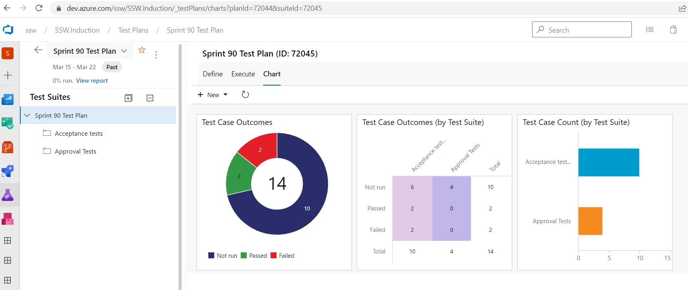

Developers sometimes think they're done when they finish coding and check in.

It's easy to forget about testing, but this will often result in rework or bug fixes for the developers - in other words, more work!

Keeping an eye on the results of [acceptance testing](/does-your-team-write-acceptance-tests-to-verify-acceptance-criteria) can help you understand where things are really at in the Sprint.

<!--endintro-->

Azure Test Plans provides two different ways to see testing status, a built-in [Progress Report](https://docs.microsoft.com/en-us/azure/devops/test/progress-report?view=azure-devops) and customizable [Test Status](https://docs.microsoft.com/en-us/azure/devops/test/track-test-status?view=azure-devops) charts.

### Progress report

Select the "Progress Report" item in the Azure Test Plans sidebar:

### Test Status charts

You can visualise the status of testing for a Sprint in various ways, using different test result charts.

From the appropriate Test Plan for the Sprint, select "Chart" and then "New test result chart" to add charts to the dashboard:

::: good

:::

:::greybox
**Tip:** Think of the red (representing failed tests) as work remaining for the developers and the blue (representing unfinished tests) as working remaining for the testers.
:::
