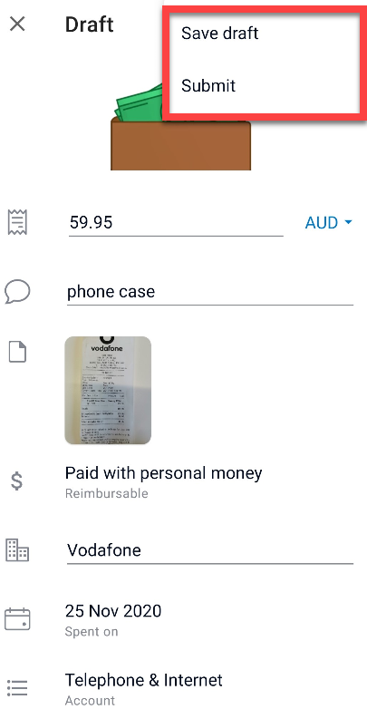
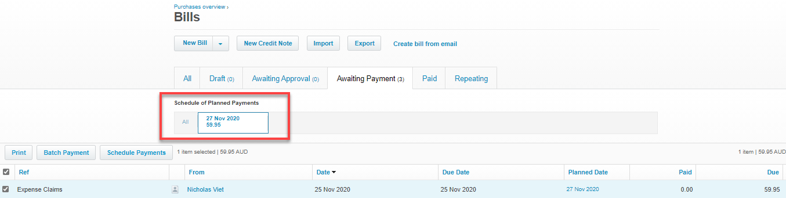
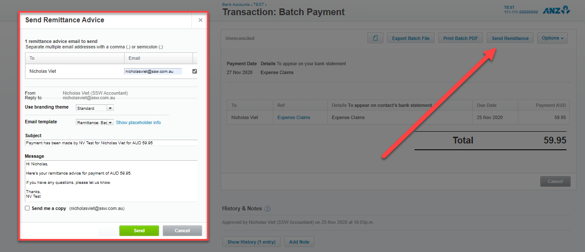

It is recommended to use an appropriate system to complete expense reimbursements. These systems will save you time and money as compared to the old method of providing paper receipts for reimbursements. It also eliminates the issue of completing reimbursements when across multiple offices.

There are many systems available for employees to use to complete an expense reimbursement (see our SSW Rules [Do you use the best mobile app for expenses?](/_layouts/15/FIXUPREDIRECT.ASPX?WebId=3dfc0e07-e23a-4cbb-aac2-e778b71166a2&TermSetId=07da3ddf-0924-4cd2-a6d4-a4809ae20160&TermId=1b68e80d-427c-47b6-ba84-b6c86f3d446d) for some recommended apps). The value provided by each system is different for every business. There are several factors to consider when choosing the right system:

* Frequency which a reimbursement is made (daily, weekly, monthly etc.)
* Number of employees approved to request expense reimbursements
* Value of expenses allowed to be reimbursed (minor, major or any values)
* Subscription cost of system
* Integration capabilities with Accounting Software

Regardless of the system, the bulk of the process should be the same across most modern systems.

At SSW we find the greatest overall value for expense reimbursements is to use the Xero Expense app and the Xero accounting system in combination. 

### Steps to completing an expense reimbursement

 **Employees:** 

  1. Using the Xero Expense mobile app, submit a photo of the receipt. If the receipt was sent via email, you can still submit a photo or screenshot of the email receipt

 **Figure: Xero Expense app submit a photo** 

2. Either allow the app to analyse the details manually or enter the details yourself (if you are strapped for time, you can take a photo and come back to it or hold on to the receipt and attend to it when possible)

 **Figure: Details required of a submitted receipt** 

 **
** 

3. Whether you allow the app to analyse the details or not, you will still be required to confirm whether the expense was paid personally or with company money

 

 **Figure: Option of reimbursable and non-reimbursable** 

4. Submit for approval and then wait to be reimbursed

 

 **Figure: Saving as draft or submit for approval** 

Note - if not already done, make sure purchase approval is forwarded to the Accountant or included in the photo submitted.

 <strong>Accountant:</strong> 

 <strong></strong> 1. Review the Xero Expense claim weekly

2. Complete a general check of the receipt details

3. Follow-up on any invoices awaiting approval, or approve those where appropriate

**Figure: Xero Expense claim approval page** 

4. Schedule for reimbursement to be in line with the upcoming pay

 **Figure: Xero payment scheduling page** 

5. Submit the reimbursement along with wage payments

6. Send remittance to employee via Xero 

 **Figure: Send remittance page post payment** 

<!--endintro-->

Related Rules

* [Do you use the best mobile app for expenses?](/use-expensify-for-expenses)
