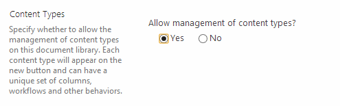
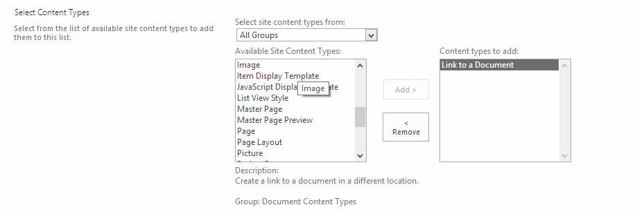
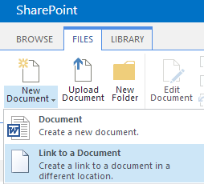
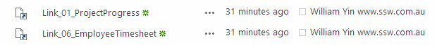

TODO TIAGO: ADD IMAGE OF WINDOWS EXPLORER (4 files in it) AND ANOTHER WITH SHAREPOINT DOCUMENTS LIBRARY

You may need a link in a SharePoint document to help you navigate to a different URL (like shortcut in Windows), there are different ways to implement this.

::: bad
A.  Create a shortcut in windows, then upload the shortcut file (.url) to the document library.
:::

::: good
B. Use "Link to a document" content type in SharePoint.
:::

<!--endintro-->

Details on how you to create a link to a document in a SharePoint library.

**A. Create a shortcut in windows, then upload the shortcut file (.url) to the document library.**

To do this, you need to remove .url file type from your blocked file types in your web application. This will bring some security risk, which is not recommended, and I won't show the step details here.

**B. Use "Link to a document" content type in SharePoint.**

1) Enable "Content Type management" in your document library.
<dl class="ssw15-rteElement-ImageArea"></dl> **Figure: Enable Content Type management in library setting** 
2) Add "Link to a Document" content type into the library.
<dl class="ssw15-rteElement-ImageArea"></dl> **Figure: Add from existing site content type** <dl class="ssw15-rteElement-ImageArea"></dl> **Figure: Select "Link to a Document" content type** 
3) Create a "Link to a document" instance
<dl class="ssw15-rteElement-ImageArea"></dl> **Figure: select "File | New Document (dropdown) | Link to a document"** <dl class="ssw15-rteElement-ImageArea"></dl> **Figure: Input "Name" and "URL"** 
4) Done

You should be able to see the link type document in your library:
<dl class="ssw15-rteElement-ImageArea"></dl> **Figure: Link type documents with the lovely shortcut icon**
