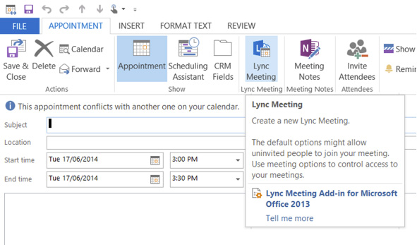

Schedule an online meeting or conference call by using the Online Meeting Add-in for Microsoft Lync communications software or by selecting contacts in Microsoft Lync.  
<!--endintro-->

To create an online meeting or conference call meeting request, follow these steps:

1. Do one of the following:
    * In the Microsoft Outlook Calendar, New Lync Meeting in Microsoft Outlook
    * In the Lync main window, in your Contacts list, hold down the "Ctrl" key and click the contacts you want to invite, right click one of the selected contacts, and then click "Schedule a Meeting". In the meeting request, click "Lync Meeting".
2. In the meeting request, in the “To” field, type the email address of each person you want to invite, separated by semicolons.
3. In the "Subject"field, type a subject for the meeting.
4. (Optional) In the body of the meeting request, above the "Join Lync Meeting" link, type additional meeting details.        
 **Note:** Do not modify any of the existing text in the meeting request. Doing so may prevent people from joining the meeting.
5. (Optional) On the "Meeting" tab, click "Scheduling Assistant". Use the "Scheduling Assistant" to ensure that everyone is available during the time you choose.
6. On the "Meeting" tab, in the "Show" group, click "Meeting Options", and then accept or change the default options as required. For more details about setting "Meeting Options" go to        [Set options for online meetings and conference calls](http://office.microsoft.com/en-us/communicator-help/set-options-for-online-meetings-and-conference-calls-HA102000107.aspx?CTT=5&origin=HA101990914).

<dl class="image">&lt;dt&gt; 
       
   &lt;/dt&gt;<dd>Figure: Creating a Lync Online meeting from outlook.</dd></dl>
Read more about     [implementing Microsoft Lync](http://www.ssw.com.au/ssw/Consulting/Lync.aspx).
