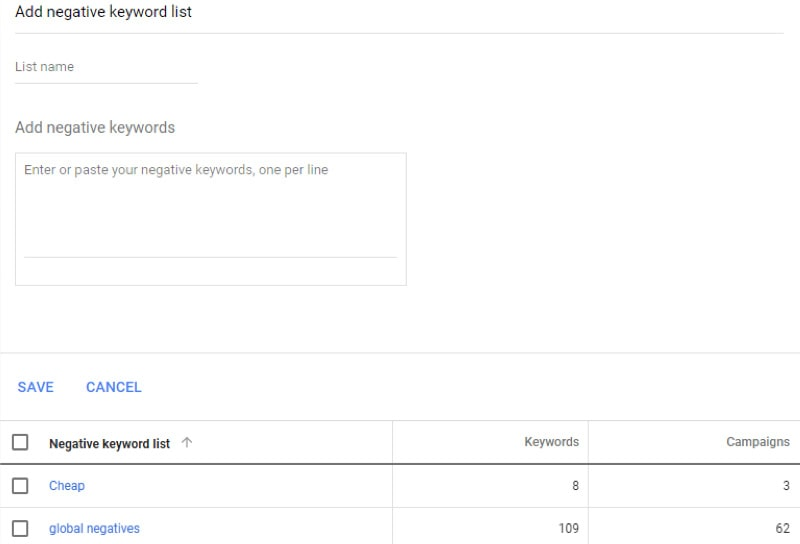

It's important to create specific negative keyword lists depending on your business, you can have lists named “cheap" or “career" related. Or you can also have a global, that would be applied to all of your campaigns.

To do that, click on: “Tools" on top right |on “Shared Library", click on Negative keyword lists.

<!--endintro-->

Then create the title and add the keywords you think that might help you either save some money from non-targeted clicks or improve your results to get your right audience.
<dl class="image">&lt;dt&gt;&lt;/dt&gt;<dd>Figure: organize your negative keywords lists </dd></dl>
