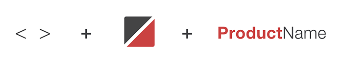

​​​Product logo design is an important tool when it comes to promoting SSW’s products or services. An SSW product logo must have a unique design that incorporates with SSW corporate visual concept and colors, makes a lasting positive impression on our customers. 

 <excerpt class='endintro'></excerpt> 
<dl class="ssw15-rteElement-ImageArea">​​ </dl><dd class="ssw15-rteElement-FigureGood">​​Figure: Good Example​​ - Some of the current SSW Product Logos </dd>
 
     

<h3 class="ssw15-rteElement-H3">1. The main parts of an SSW product logo </h3>A well designed SSW product logo has three parts: a pair of angle brackets, an icon, and the product name. 

<dl class="ssw15-rteElement-ImageArea"> 
         
         ​​Figure: Main parts of an SSW product logo</dl><dl class="ssw15-rteElement-ImageArea">
          </dl><h3 class="ssw15-rteElement-H3"> 2. The color of an SSW product logo </h3>

 The colors used on the SSW product logo are the primary colors of SSW which are red and charcoal. 
      <table style="width:100%;color:#ffffff;text-align:center;"><tbody><tr style="height:40px;"><td style="background-color:#cc4141;width:50%;">#CC4141 | RGB (204,65,65)</td><td style="background-color:#333333;width:50%;">#333333 | RGB (51,51,51) </td></tr></tbody></table> 
        
   

An SSW product logo can be shown in these color variations: Two-Colored, SSW charcoal, true black, or all white. 
<dl class="ssw15-rteElement-ImageArea">
      
   </dl><dd class="ssw15-rteElement-FigureGood">​​​​​​Figure: Good Example - ​TimePro logo in 4 different colors </dd>

       
   
<h3 class="ssw15-rteElement-H3">3. The font of an SSW product logo </h3>
The font used on SSW product logo is Helvetica Neue LT Pro​, the font weight for the first part of the product name is 75 Bold, for the second part of the product name is 45 Light. ​​ 

 
     

<h3 class="ssw15-rteElement-H3">4. The vertical layout of an SSW product logo </h3>
A vertical layout version should also take consideration when creating an SSW product logo. Place the icon set and product name vertically, make the product name 80% of the original size (e.g. 30pt for original, 24pt for vertical). 
<dl class="ssw15-rteElement-ImageArea">
   
</dl><dd class="ssw15-rteElement-FigureGood">Figure: Good Example -​Vertical version of TimePro logo​ </dd>

