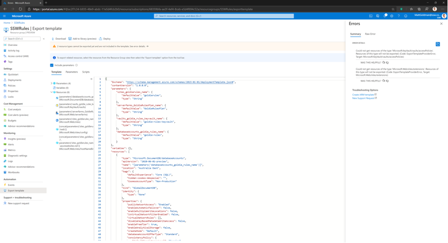
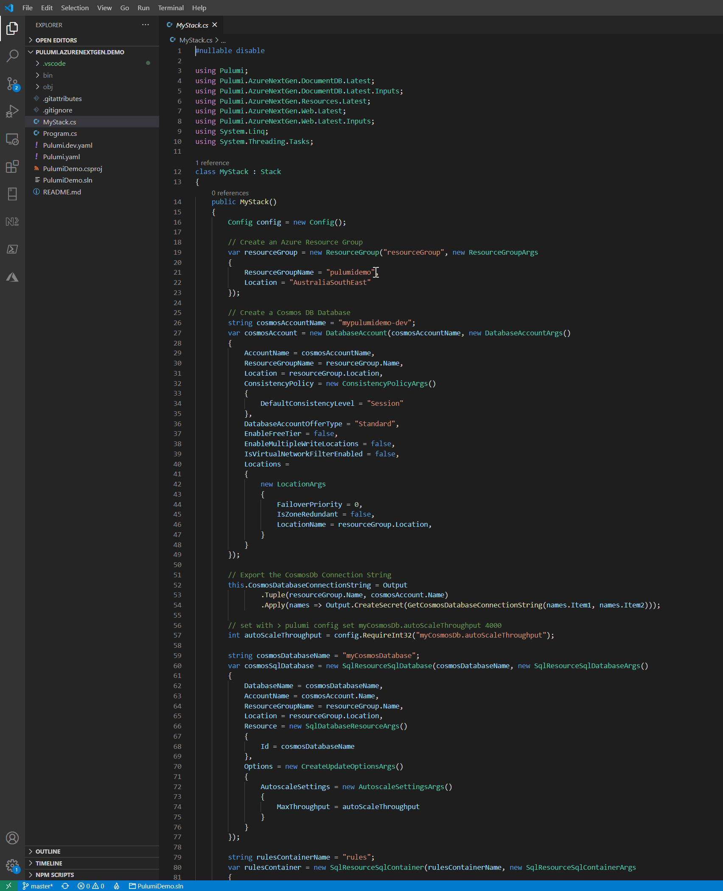

We’ve been down this road before where developers had to be taught [not to manually create tables and databases](/_layouts/15/FIXUPREDIRECT.ASPX?WebId=3dfc0e07-e23a-4cbb-aac2-e778b71166a2&TermSetId=07da3ddf-0924-4cd2-a6d4-a4809ae20160&TermId=a4ca7d22-069a-4727-b54a-a1cf1d5a5ef4). Now, in the cloud world, we’re saying the same thing again. Don’t manually create your Azure resources.

`youtube: https://www.youtube.com/embed/8E63s2QlbhA`
 

<!--endintro-->

### Manually Creating Resources

This is the most common and the worst. This is bad because it requires manual effort to reproduce and leaves margin for human error.

* Create resources in Azure and not save a script

<dl class="badImage">&lt;dt&gt; 
       
   &lt;/dt&gt;<dd>Figure: Bad Example – creating resources manually </dd></dl>
### Manually creating and saving the script

Some people half solve the problem by manually creating and saving the script. This is also bad because it’s like eating ice cream and brushing your teeth – it doesn’t solve the      **health** problem.
<dl class="badImage">&lt;dt&gt; 
       
   &lt;/dt&gt;<dd>Figure: Bad Example – Exporting your Resource Group as an ARM template defined in JSON  </dd></dl>

<dl class="badImage">&lt;dt&gt; 
       
   &lt;/dt&gt;<dd>Figure: Warning - often templates don't work and need to be manually tweaked </dd></dl>
* **Warning:** The templates are crazy verbose

::: greybox
**Tip:** Save scripts in a folder called Azure
:::

<dl class="goodImage">&lt;dt&gt; 
       
   &lt;/dt&gt;<dd>Figure: Good example - However you generate your ARM template, save it in an Azure folder like this example (SSW TimePro) </dd></dl>

So if you aren't manually creating your Azure resources, what options do you have?

### Option A: Terraform

https://www.terraform.io/docs/providers/azurerm/index.html

* It’s a great tool
* Free for up to 5 users with limited features
* Not recommended because:
    * Pulumi is better
    * Proprietary ‘HCL’ (Hashicorp Configuration Language) which is as bad as YAML

### Option B: Ansible

[https://www.ansible.com](https://www.ansible.com/)

* Proprietary product owned by RedHat
* First red flag – ‘Contact us for pricing’ – a toxic warning sign of their lack of transparency

### Option C: Bicep by Microsoft

https://github.com/Azure/bicep

* Experimental
* Not a huge step forward from ARM templates
* But is one to watch

### Option D: Farmer (Recommended)

[https://compositionalit.github.io/farmer](https://compositionalit.github.io/farmer/)

* It's a great tool
* Simply add a very short and readable F# project in your solution
* Tip: The F# solution of scripts should be in a folder called .azure

<dl class="goodImage">&lt;dt&gt; 
       
   &lt;/dt&gt;<dd>Figure: Good Example – using Farmer to define your ARM template in F# code </dd></dl>
### Option E: Pulumi (Recommended)

[https://www.pulumi.com](https://www.pulumi.com/)

* It's a great tool that uses real code (C#, TypeScript, Go, and Python) as infrastructure rather than JSON/YAML
* Abstracts the entire Azure REST API to the language of your choice (see above)
* Includes a tool for converting your existing JSON ARM templates into code: [Arm2Pulumi](https://www.pulumi.com/arm2pulumi/)
* Free for individual developers (even for commercial use), but is a paid product for teams > 1

<dl class="ssw15-rteElement-ImageArea">   
</dl>

::: good
Figure: Good Example - Code from the Pulumi Azure NextGen provider demo with Azure resources defined in C#

:::

<dl class="ssw15-rteElement-ImageArea">   
</dl>

::: good
Figure: Good Example - From the console simply run 'pulumi up' to deploy your resources to Azure

:::

###  What’s Mainstream?

It’s early days so     [not much help (from Google trends)](https://trends.google.com/trends/explore?q=azure%20pulumi%2cazure%20teraform%2cazure%20ansible%2cazure%20farmer%E2%80%8B) yet.
<dl class="image">&lt;dt&gt;
      
       
   &lt;/dt&gt; <strong>Figure: Google Trends shows that Terraform is the most searched for as it’s been around the longest and is well established </strong> </dl>
### General Tips

* After you’ve made your changes, don’t forget to        [visualize your new resources](/_layouts/15/FIXUPREDIRECT.ASPX?WebId=3dfc0e07-e23a-4cbb-aac2-e778b71166a2&TermSetId=07da3ddf-0924-4cd2-a6d4-a4809ae20160&TermId=d494984e-5089-43e2-bc4d-917fd9248148)
