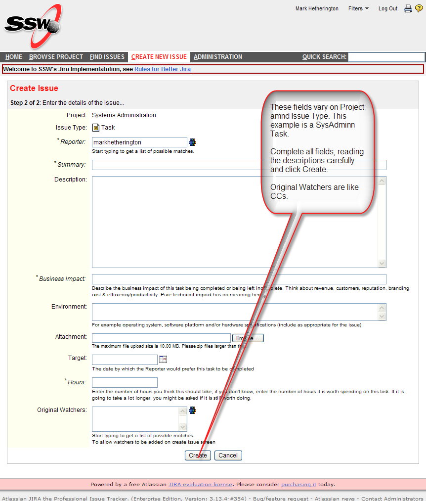

If the task is for SysAdmins you can send an email to <a href="mailto:jira@ssw.com.au" shape="rect">jira@ssw.com.au</a> with the summary in the subject and the description in the message body.  However, if more information is required you will then be asked a quesion in Jira.  <a href="/Pages/HowdoIansweraquestioninJira.aspx" shape="rect">Do you know how to answer it?</a>  A better way, and the way it must be done for all other projects, is to <a class="ms-rteCustom-External" href="/Pages/CreateTask.aspx" shape="rect">create an issue </a> in Jira ...... ​
 <excerpt class='endintro'></excerpt> 
      Somebody should quickly acknowledge and priortise it and you can see it in your  Once priroritsed, you will be able to <a href="/Pages/TrackingRequests.aspx" shape="rect">track</a> it. 

