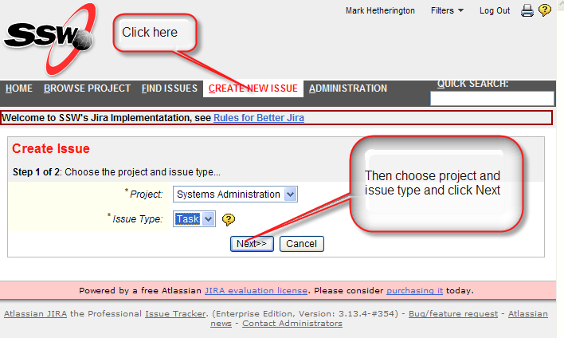

If the task is for SysAdmins you can send an email to jira@ssw.com.au with the summary in the subject and the description in the message body.  However, if more information is required you will then be asked a quesion in Jira.  [Do you know how to answer it?](/Pages/HowdoIansweraquestioninJira.aspx)

A better way, and the way it must be done for all other projects, is to [create an issue](/Pages/CreateTask.aspx) in Jira ......  
<!--endintro-->

 

Somebody should quickly acknowledge and priortise it and you can see it in your 
Once priroritsed, you will be able to [track](/Pages/TrackingRequests.aspx) it.
