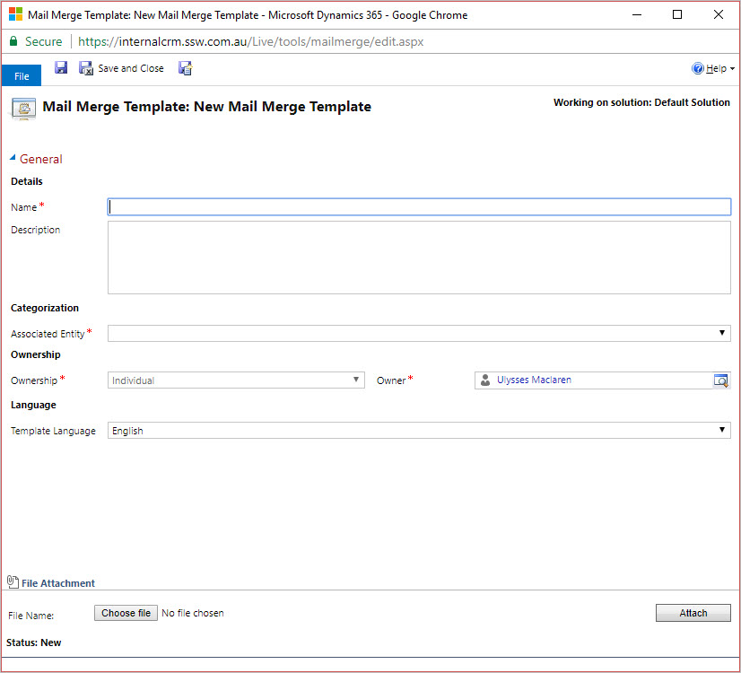
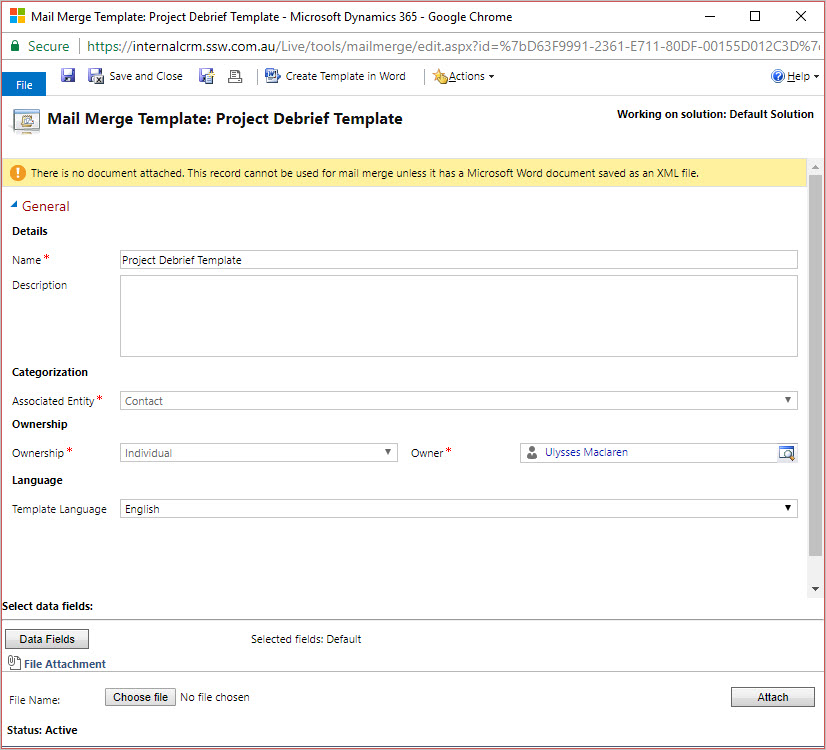
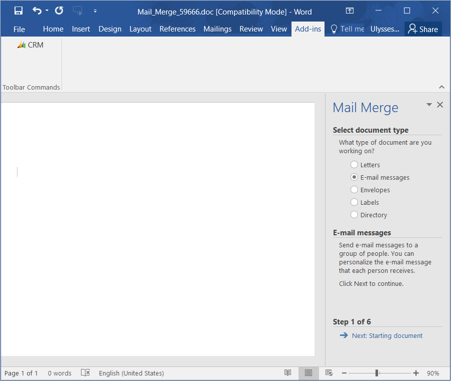

The following instructions to create Microsoft CRM 2016 mail merge template require you to have Microsoft CRM Outlook add-in installed on your Outlook, and you need to open Outlook while creating the template:

<!--endintro-->

1. Go to
   **Settings** from Microsoft CRM 2016 home page.
2. Click
   **Templates** on the left navigation panel.
3. Click
   **Mail Merge Templates** on right content panel.
4. Click button
   **New** to create the new mail merge template.
5. Fill in the mail merge template details and leave the
   **File Attachment** fields empty.

  
6. Click the
**Save** button to save your template. 7. After you save the template, click the button
**Create Template in Word** to start creating the template content.

  
8. A Microsoft Word document will be open on your machine. 9. Click Addins | CRM 10. Follow on screen instructions on the right panel of the word document to create the template.

