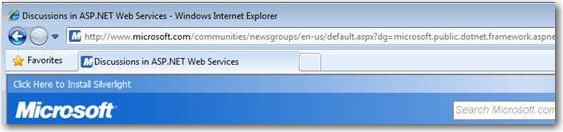

There are a lot of reasons to have nice URLs for your website: 
* Easy to remember
* Easy to navigate
* Better for search engines

<!--endintro-->
<dl class="badImage">    &lt;dt&gt; &lt;/dt&gt;
    <dd>Figure: Bad example – This URL is impossible to remember for your users, and even search don’t like these URLs </dd></dl><dl class="goodImage">    &lt;dt&gt; &lt;/dt&gt;
    <dd>Figure: Good example – Nice clean URL, easy to remember, easy to guess where I am and good for search engines </dd></dl>
With ASP.NET 4 it is easy to create this URLs. The ASP.NET team includes routing features, known from the MVC web framework.
 Add a route in Global.asax
<dl class="goodCode">    &lt;dt&gt;
    <pre>protected void Application_Start(object sender, EventArgs e) {     //RouteTable and PageRouteHandler are in System.Web.Routing     RouteTable.Routes.Add("ProductRoute",         new Route("products/{productname}",         new PageRouteHandler("~/ssw/Products/ProdCategoryList.aspx"))); }</pre>
    &lt;/dt&gt;
    <dd>Figure: Example on how to route www.ssw.com.au/products/{everything} to the www.ssw.com.au/ssw/Products/ProdCategoryList.aspx page </dd></dl>
**Note** : There is no dependency on the MVC framework in order to use this code.
**Note** : IIS7 has a module called [URL rewrite module](http://www.iis.net/learn/extensions/url-rewrite-module/using-the-url-rewrite-module) that can do this functionality without changing any code. Just a configuration of a "Rule" in the IIS Manager.
