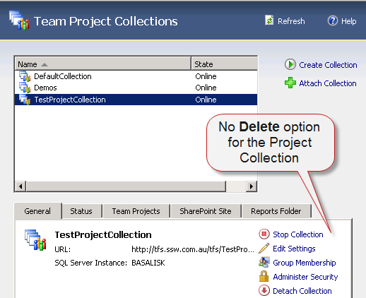
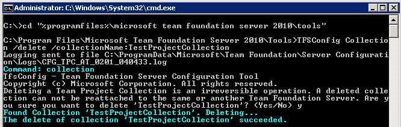

When you initially setup a TFS server, you may add a Team Project Collection for testing purposes. After you have confirmed TFS, SharePoint and Reporting services is all working, you want to remove the test collection you made, but alas, there is no Delete option for project collections.  
<!--endintro-->

 
Figure: There is no way to delete the Team Project Collection from the TFS Administration console. 
To delete the unwanted Team Project Collection:

1. On your TFS server, open an  **Administrative Command Prompt**
2. Change into the TFS Tools Directory. Type:
 **cd "%programfiles%\microsoft team foundation server 2010\tools"**
3. Type in the following (replacing [COLLECTION NAME] with the collection you want to delete):
 **TFSConfig Collection /delete /collectionName:[COLLECTION NAME]
**

Figure: Use the TFSConfig tool to delete a Team Project CollectionIf you created a SharePoint Portal for your Team Project Collection, you should clean it up as well.

1. Open the URL of your Team Project Collections SharePoint portal (eg. http://northwind.com.au/tfs/TestProjectCollection)
2. Select  **Site Actions** |  **Site Settings** on the right
3. Under the  **Site Administration** subheading, click on  **Delete this site**
4. Confirm the deletion

If you created a Reports site for your Team Project Collection, you should clean it up as well.

1. Open the URL of your Reporting Services page (eg. http://tfs.ssw.com.au/Reports/)
2. Click on the  **TfsReports** folder
3. Click on the name of the Team Project Collections folder
4. Click  **Properties** in the top navigation
5. Click on  **Delete**

Now your TFS server is nice and clean and fit for production.
