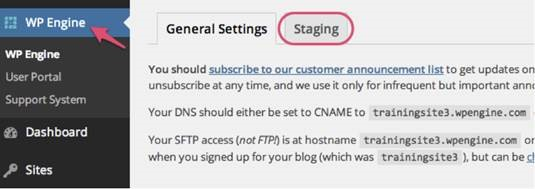
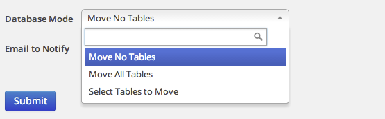

<h3 class="ssw15-rteElement-H3">Pushing Staging to Live </h3>
By default, only your files will be copied back to LIVE. You can move content by checking the tables you would like to move below. Keep in mind these tables will replace the LIVE version with the STAGING version. So for instance, if you choose to move wp_posts all posts added to the LIVE site since the staging site was created will be removed. However, a <strong>checkpoint of your site will be created so you can 'undo' the changes if necessary</strong>.  

After logging into your live site's /wp-admin click the WP Engine button on the top left-hand side. Then, click the "Staging" tab. 
<dl class="image"><dt>   
   </dt><dd> Figure: Staging tab in WordPress</dd></dl>
Then, choose from the following options:
<dl class="image"><dt> </dt> </dl>

   When pushing changes from staging to live the file system from staging does not overwrite the live file system but instead, merges with the live file system. 

This means any updated files in staging will be updated on live after a push, but any deleted files in staging would not be deleted in live.

   <strong>If you want to push all changes, except for pages, posts and users to your live site, </strong>select all database tables <strong>except:</strong>
<ul><li>wp_posts, </li><li>wp_postmeta, </li><li>wp_users and wp_usermeta. </li></ul>
<strong>​If you push no database tables,</strong> only changes to theme files, core WordPress files and plugin files will be pushed to the live site.

<strong>If you select all tables, any new posts, pages or users changes made to the live site during your work in the staging area will be overwritten.</strong>

 <excerpt class='endintro'></excerpt> 

