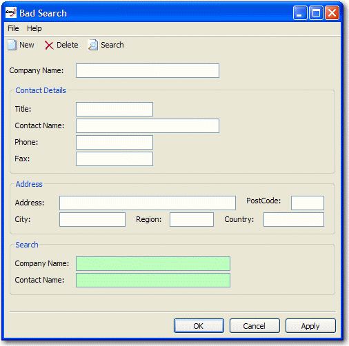
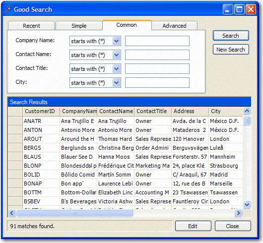

Designing a user-friendly search system is crucial in today’s information-driven world, as it significantly enhances the user experience by enabling efficient and effective access to relevant data. A well-structured search interface not only simplifies the process of locating specific information amidst vast datasets but also caters to a variety of user needs, from basic inquiries to complex queries. 

By prioritizing clarity, simplicity, and adaptability in search design, we can ensure that users can navigate and utilize applications more intuitively, leading to increased productivity, satisfaction, and overall success of the software.

<!--endintro-->

::: bad

:::

::: good

:::

Therefore, I believe search system should: 

1. **Importatnt** - Separate it from the data entry fields (on a different form) - this avoids confusion 
2. Have a "Simple" tab this shows minimum fields, that is just one like Google.   
   E.g. A customer calls, they said they were from Winkleton, but I'm not sure what that is. Do I put it in the Region, City or Address fields? so you need to simply search in all fields with one single text box.
3. Have a "Recent" tab this shows the most recent records opened/updated
4. Have a "Common" tab this shows the common fields   
   **Note:** Preferred over customers needing to learn prefixes like Google (for example, "city:winkleton").
5. Have an "Advanced" tab only for power users for building up a WHERE clause

We have a program called [SSW .NET Toolkit](https://ssw.com.au/ssw/NETToolkit/02WinSearch.aspx) that implements this cool Search Control.
