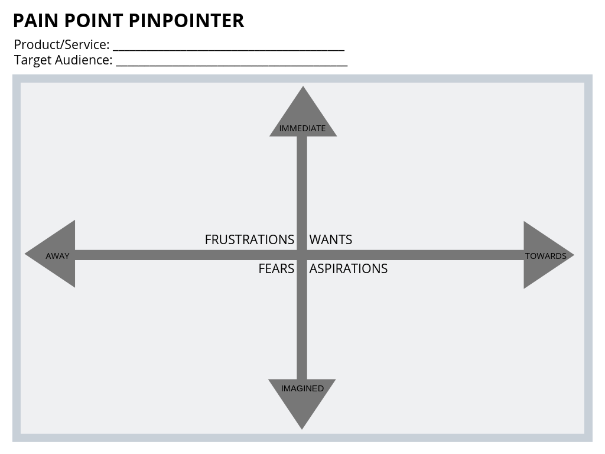

Before you move onto this step, first have your target audience information right next to you. Understanding your prospects most pressing pain points should be huge priority.
Start thinking - what do they want? What are their frustrations? What are their aspirations? And finally, what do they fear? Write down all the ideas you might come up with.

<!--endintro-->

Use the template below to brainstorm with your team or your client:

You have a few some ways of doing this, you can:

- Brainstorm with your employees
- Research online
- Ask your clients directly in person, or to have an open conversation through social media (remember to reply and engage with them, though!)
