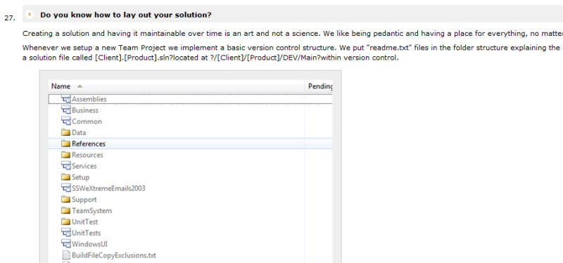
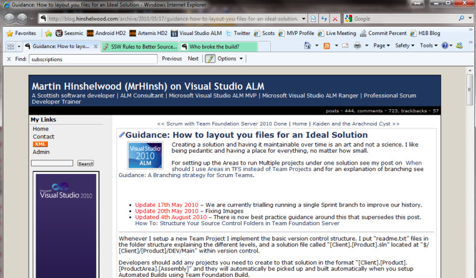

If you are recording a choice you should create a rule, if you are explaining how you did something, it should be a blog post.

If you are writing a really long email, ask yourself if it would be better as a lining blog post rather than a one off email.

Also see: [Do you know to make what you can public?](/_layouts/15/FIXUPREDIRECT.ASPX?WebId=3dfc0e07-e23a-4cbb-aac2-e778b71166a2&TermSetId=07da3ddf-0924-4cd2-a6d4-a4809ae20160&TermId=257bcb90-884d-49bd-8e15-e639c70f7de1)

<!--endintro-->
<dl class="image">&lt;dt&gt; &lt;/dt&gt;<dd>Figure: This rule describes the choice that was made </dd></dl><dl class="image">&lt;dt&gt; &lt;/dt&gt;<dd>Figure: This blog post documents the task or thought process </dd> </dl>
**Hint:** If you are really good you will end up with one or more rules, a blog post and a link in your email
