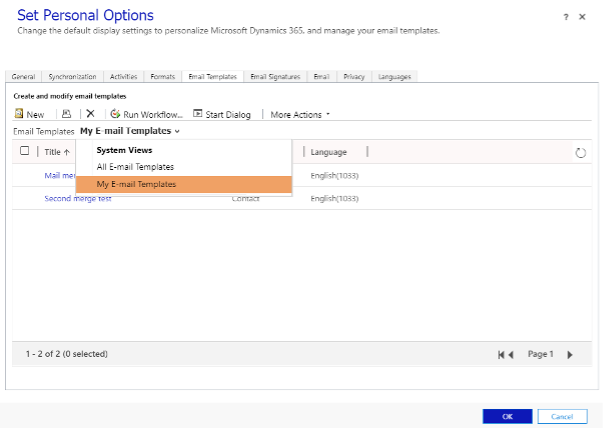

These are the steps to edit a mail merge template in Dynamics 365:

<!--endintro-->

1. Go to the **Settings** cog in the top right-hand corner of Dynamics 365, then click **Personalization Settings**
2. In the **Personalization Settings** window that pops up, click **Email Templates**
3. You can then choose to view/edit your own personal templates or all email templates
  

4.	Click on the name of the template that you want to edit, a window will pop up with the template details, OR click on **New** to create a new template
5.	Edit, save, and close
