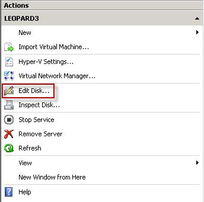
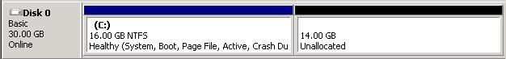
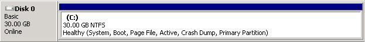

Occasionally when you estimate the size of a VHD that you will be using in a server, you can get it wrong and you will need to give the Virtual Machine some more space. Instead of adding a bigger data disk in the Virtual Machine and migrating data, you can expand the existing disk.   
<!--endintro-->

1. Open the **Hyper-V Manager** on the server hosting the Virtual Machine
2. Shutdown the virtual machine
3. Click  **Edit Disk...** in the  **Actions** pane of the  **Hyper-V Manager

** Figure: You expand a VHD from the Actions Menu | Edit Disk
4. In the  **Edit Virtual Hard Disk Wizard** window, choose the VHD you want to edit and choose  **Next.**
5. Select  **Expand** and click  **Next**
6. Enter the new size of the VHD and click  **Next**

You will now have a resized VHD. Next step is to boot up into the virtual machine and tell disk manager to resize the partition on the VHD to use the free space which has been added at the end of the VHD. Windows Server 2008 makes this very simple:

1. Boot into the virtual machine
2. Open  **Computer Management** and choose  **Disk Management**
3. Right click on the partition sitting at the front of the newly resized disk and click on  **Extend Volume...

**  <b>Figure: The first partition on the disk needs to be expanded to use up the unallocated space created when expanding the VHD</b> 
4. You will have to use all the available space when you extend the volume as it is a Simple Volume. (See Rule: [Do you use Basic Volumes inside VHD’s?](/Pages/Do-you-use-Basic-Volumes-inside-VHDs.aspx)) When you are asked to select your disks just click  **Next**
5. Click  **Finish

** Figure: The disk is now using all the available space inside the VHD
