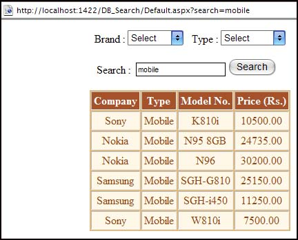

It is difficult for users to find their required records in a huge amount of data, so adding the filter data functionalities is very useful.

<!--endintro-->

The standard DataGrid of ASP.NET doesn't include this functionality, developers need to implement it by themselves.

::: bad  
  
:::

Fortunately, RadGrid supplies this perfect feature.

::: good  
  
:::

Developer can turn this feature on by setting the AllowFilteringByColumn="True".
