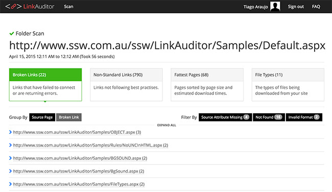

Often times, web pages are dynamic. Most link scanners are not capable of submitting form information. The trick is to allow a "door" for link scanner go through to scan a dynamic section of a site. A common technique is to hard code hidden link with a query string at the bottom of the page that allows the link scanner to follow into the simulated user input. See the following code for example: 

<!--endintro-->
<dl class="goodCode">&lt;dt&gt;<pre><a href="KB.aspx?KBID=Q1097707">Q1097707 - How do I turn Option Strict on by default in VB.NET?</a> </pre>&lt;/dt&gt;<dd>Figure: Example source code - finding broken links </dd></dl>
It will return all the knowledge base articles in a paged format. The link scanner will click the Next Page link and eventually scan through the entire knowledge base.

[Google webmaster tools](https://www.google.com/webmasters) and [Bing webmaster centre](http://www.bing.com/toolbox/webmaster/) are useful tools to monitor links.
<dl class="image">&lt;dt&gt;    
   &lt;/dt&gt;<dd>Figure: In Google webmaster tools you can see all broken URLs, and even the pages who are linking to them (known as referrer, found in the 'Linked From' column)</dd></dl><dl class="image">&lt;dt&gt;  &lt;/dt&gt;<dd>Figure: In Bing webmaster centre you can find the broken URL which is linked by the above URL </dd></dl>
We have a program called [SSW Link Auditor](https://sswlinkauditor.com/) to check for this rule.
<dl class="image">&lt;dt&gt;  &lt;/dt&gt;<dd>Figure: SSW Link Auditor automatically locate broken links</dd></dl>
