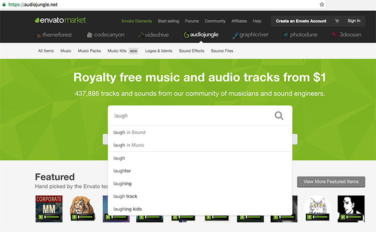
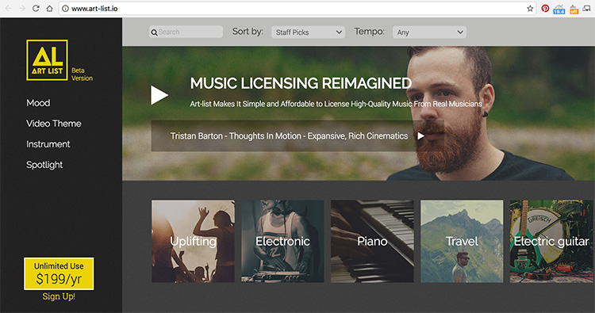

​​​​You should never use any copyrighted work without permission. When it comes to videos, if you have licensed music or songs on your YouTube video, it might be entirely removed from the site. To avoid this, use <b>royalty free</b> music.​
 <excerpt class='endintro'></excerpt> 
<dl class="badImage"><dt>  </dt><dd>Bad example: Ripping someone's song - your video will get taken down by YouTube </dd></dl><h3 class="ssw15-rteElement-H3">Royalty Free Music  </h3>
There are many options available for purchasing high-quality royalty free music.  

The two we use at SSW are <a href="https://audiojungle.net/" target="_blank">audiojungle.net</a> and <a href="https://artlist.io/" target="_blank">Art List Music</a>.

Audio Jungle is great for finding sound effects and <a href="https://en.wikipedia.org/wiki/Foley_%28filmmaking%29" target="_blank">Foley</a> sounds. You can also find many great full-length songs that suit corporate video. However, the music style is typically geared towards online ads and marketing videos  and doesn't quite have that 'professional' sound you get from bands and mainstream artists.  
<dl class="goodImage"><dt>  </dt><dd> Good example: E.g. AudioJungle.net - you can pay $1 for a laugh track  </dd></dl>
If you want audio that sounds more like professional music created by bands and artists but still designed for corporate, then use Art List Music.
<dl class="goodImage"><dt>  </dt><dd>Good example: E.g. Art List Music - For $200 per a year, you get unlimited access to really awesome quality music. Have a listen on the website</dd></dl>  

