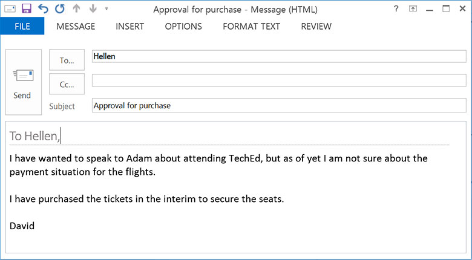
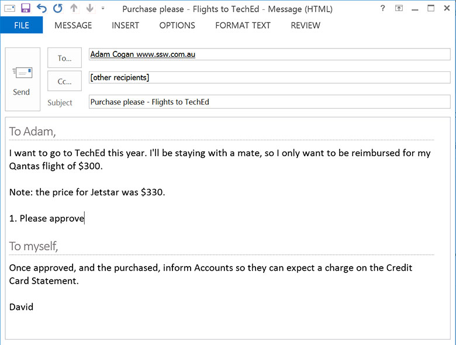

When you need to spend money, don't assume you will get authorization – make sure you have approval before spending the money.

<!--endintro-->

Let's have a look at the best way to get authorization:

1. Send an email to your boss, manager, or financial controller (or whoever the appropriate person is in your company) outlining what you want to purchase and why. You should provide as much information as possible and recommendations, so it's easy as "rubber-stamping". Your goal should be to make your purchase as easy as possible to be approved!
2. The email subject should be "Purchase Please - Request for xx"
3. If appropriate, include 2 or 3 quotes (call them "Option A, Option B etc") aiming to keep expenses low, and which you think is the best option
4. End the email with "Please approve"
5. Wait for an email back with "Approved" (*prior to the purchase*, or you may not get reimbursed later)
6. Forward a copy of the email to the financial controller/accountant with:

   * Your manager's approval (in the history)
   * Attach the tax invoice
   * State how the payment was made (whether you paid it yourself and need reimbursing or if it was on a company credit card, and if so, which one)
   * If this is for a client, include the Client ID/name
   * If it is for a client, include if it is to be on-charged (E.g. please invoice - add 20%)
   * Try to obtain receipts in English, if they are not, you must write on the receipt what it is, and what it was for

### **Cross authorization**

We recommend having a cross-authorization system in place that follows your hierarchy. You should not be blocked by reasonable purchases (e.g. under $500).

Here is an example: Sophie works in Marketing and wants to spend $400 on an ad campaign. If she can't reach the State Manager, try another State Manager, then their boss, then other Head of department, then the Accounting department, then any senior person that sits next to her... 

This system means no one is blocked.

### Exceptions

When approving purchases, you might come across some exceptions depending on the business/industry you are in. Here are some examples:

* IT - Be mindful that IT purchases could be of a higher amount and require a unique approval flow.
* Marketing - The marketing team usually works with a previously approved budget and this could vary in period e.g. monthly, quarterly, etc.
* One-time vs. subscriptions - Make sure to highlight when a cost will be a one-off or recurring cost. This is important if the team works on a budget basis.

::: bad\
\
:::

::: good\
\
:::