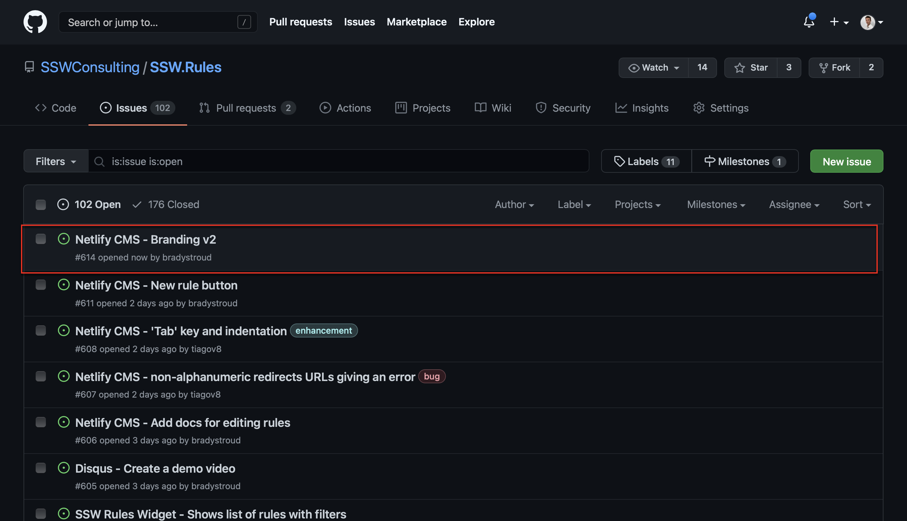
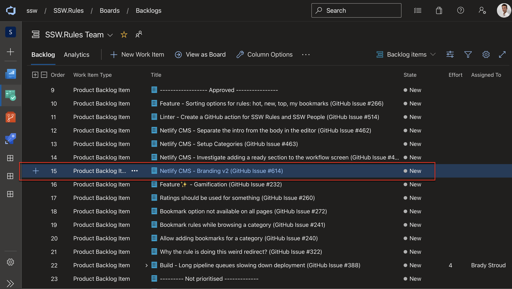

The goal is always to complete Product Backlog Items (PBIs) for the Sprint Review.

Often PBIs grow or change and it does not make sense to deliver what was originally proposed in the Acceptance Criteria.

<!--endintro-->

So think of a way to deliver business value and get it in production, then have a hallway conversation with the Product Owner to see if he agrees with you.

Assuming approval, then adjust some of the Acceptance Criteria, add "v1" to the PBI name and move some of the functionality to a new PBI with the same title and "v2".

e.g.

* Customer and Contact Form v1
* Customer and Contact Form v2

**Note:** A common example for when to use this is when the full acceptance criteria of a large PBI (or Epic) would not be attaionable within one sprint, so splitting an Epic into 2 attainable PBIs is a better option.

