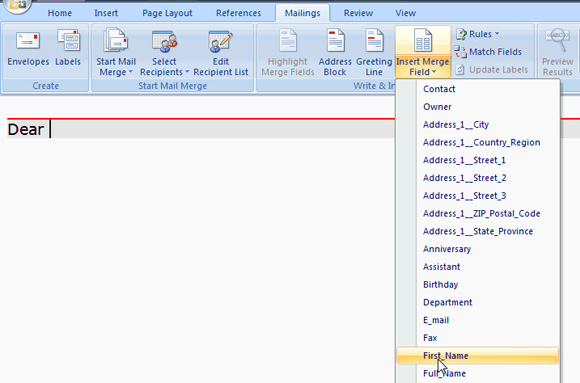

While editing your mail merge template in Microsoft Word, you can add CRM data field in the template. For example, you can add the contact's first name in my mail merge template.

<!--endintro-->

1. While you're editing your mail merge template in Microsoft Word, click the  **Mailings** tab.
<dl class="image">&lt;dt&gt;&lt;/dt&gt;<dd>Figure: Click the Mailings tab</dd></dl>2. Click  **Insert Merge Field** on the Ribbon.
3. Select the field from Microsoft CRM that you want to insert, in this case I'm inserting                             contact's first name.
<dl class="image">&lt;dt&gt;
                                &lt;/dt&gt;<dd>Figure: Insert contact's first name in mail merge template</dd></dl>4. Finish your editing your template and upload the template to CRM 2011.
