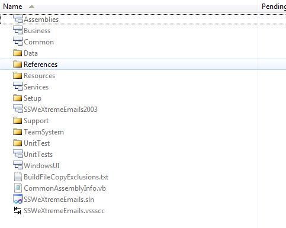
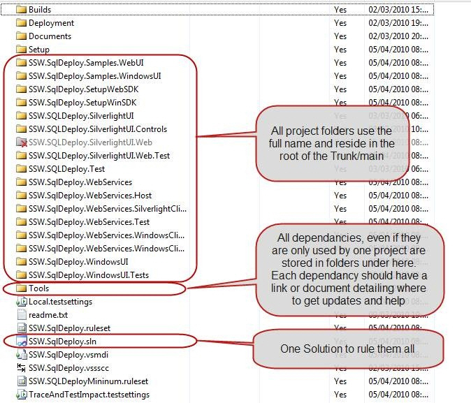

Whenever we setup a new Team Project we implement a basic version control structure. We put "readme.txt" files in the folder structure explaining the different levels, and a solution file called [Client].[Product].sln?located at ?/[Client]/[Product]/DEV/ within version control.

::: bad  
  
:::

<!--endintro-->

::: good  
  
:::

For more implementation details see:     
[http://blog.hinshelwood.com/archive/2010/05/17/guidance-how-to-layout-you-files-for-an-ideal-solution.aspx](http://www.ssw.com.au/ssw/redirect/LayoutSolution.htm)

### Related rule

* [Do you have a consistent .NET Solution Structure?](/do-you-have-a-consistent-net-solution-structure)
