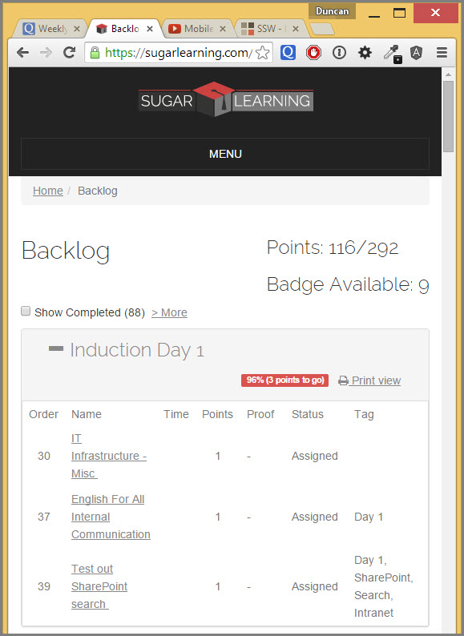
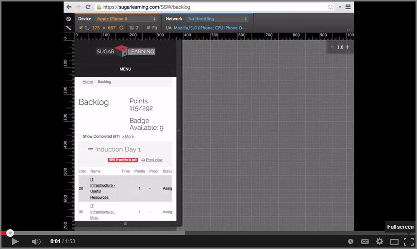

​Making a video of a responsive website as it appears on a mobile phone takes some extra care. If you do not zoom in correctly or use the right browser tools your video can be too small to see or it may not be clear it is a mobile emulation. 

 <excerpt class='endintro'></excerpt> 

​​​You should use Device Mode & Mobile Emulation in the Chrome browser to make a video an emulated mobile phone view.

<blockquote style="margin:0px 0px 0px 40px;border:none;padding:0px;">
 
</blockquote>

<dl class="bad" style="margin:0px;padding-top:10px;padding-bottom:10px;padding-left:20px;font-family:arial, helvetica, sans-serif;line-height:17px;"><dd style="margin-top:-2px;margin-left:0px;padding-bottom:7px;padding-left:1.7em;">Figure: Bad example - Using your browser makes it hard to see the video is a mobile phone demo.  </dd></dl><dl class="good" style="margin:0px;padding-top:10px;padding-bottom:10px;padding-left:20px;"><dd style="font-family:arial, helvetica, sans-serif;line-height:17px;margin-top:-2px;margin-left:0px;padding-bottom:7px;padding-left:1.7em;">Figure: Good example - Using Device Mode & Mobile Emulation in Chrome makes it clear the video is a mobile phone demo.</dd><ul><b>Steps to make a good mobile phone video demo:​ </b></ul><ol><li style="color:#555555;">​Use Device Mode & Mobile Emulation in Chromes Dev tools. You can watch or read a great intro to this tool on the <a href="https://developer.chrome.com/devtools/docs/device-mode">Chrome Developer Website​</a></li><li style="color:#555555;">Choose the mobile phone size ​you want to emulate.</li><li style="color:#555555;">Use Camtasia or an alternate video screen capture software of you choice that allows you to zoom in post production. Unfortunately this is not available in <a href="http://www.techsmith.com/snagit.html">Snagit</a>, which we normally suggest to use when making screen casts.</li><li style="color:#555555;">If using Camtaisa, set the video canvas to be HD for better video quality on YouTube.  Figure: How to adjust the video canvas in Camtasia to export HD video to YouTube.  </li><li style="color:#555555;">You can directly upload your video to YouTube from Camtasia by clicking on share in the main menu and entering your credentials.  </li></ol>
<b>Example video​</b>

<b></b>​You can watch an example of a video shot of an emulated mobile view using these toolsdescribed in this article <a href="https://www.youtube.com/watch?v=eyiqryb5y1Y">here.​</a> ​<strong> </strong><strong>​​ </strong>

<strong>​Additional resources</strong> 
<ul><li>​​<a href="http://www.techsmith.com/camtasia.html">Camtasia video tools</a> </li><li><a href="https://developer.chrome.com/devtools/docs/device-mode">Chrome Device Mode & Mobile Emulation​​</a></li><li></li></ul>   </dl>

