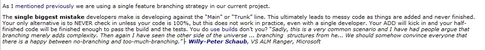
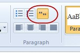

​When you add a quotation, put them in a new line with an indent.

 <excerpt class='endintro'></excerpt> 

​Software development can be painful and costly. Hang on, that should say "Software development IS painful and costly."
<dd class="ssw15-rteElement-FigureBad">Figure: Bad Example - The quotation without a new line or indent</dd>
​​

Software development can be painful and costly. Hang on, that should say: ​  "Software development IS painful and costly."
<dd class="ssw15-rteElement-FigureGood">Figure: Good example - The quotation on a new line and indenting​</dd>
You should always indent any quotes that you use on a new line.​ 

 
<dd class="ssw15-rteElement-FigureBad">Figure: Bad example - It is hard to tell where the quote is​ </dd>
 
<dd class="ssw15-rteElement-FigureGood">​Figure: Good example - It is obvious that this is a quote and it is laid out nicely. </dd>
<strong> Tip: </strong>In Windows Live Writer there is a button for this: 

 

<dd class="ssw15-rteElement-FigureNormal">Figure: Use the Quote button in Windows Live Writer​</dd> 

This wraps your text in a <blockquote> HTML element. This lets you display it any way you like on a web page.​

 

