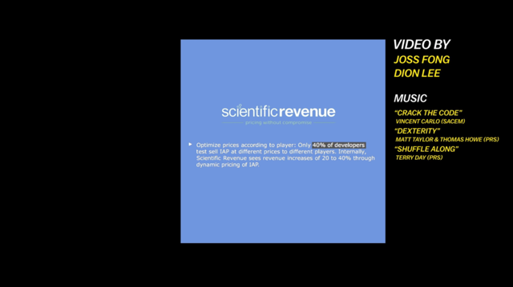

Do you know free games are designed to make money? See the good and bad examples:

<!--endintro-->

::: bad
Bad example: paid apps

:::

::: good
Good example: free apps with in-app purchases
:::

::: bad
Bad example: paid with currency
:::

::: good
Good example: paid with abstract currency 
:::

::: bad
Bad example: treat all customers the same
:::

::: good
Good example: detect when a customer might leave and offer them incentives
:::

::: bad
Bad example: same prices for everyone
:::

::: good
Good example: capture data eg. What device and do data mining to set different prices 

:::

<dl class="image">&lt;dt&gt;
 
    `youtube: https://www.youtube.com/embed/fKK9nVLvhGM`  
&lt;/dt&gt;</dl><dl class="image">&lt;dt&gt;
       
   &lt;/dt&gt;<dd>Figure: some apps charge more based on the device you are using </dd></dl><dl class="image"> 
   &lt;dt&gt; 
       
   &lt;/dt&gt;<dd>Figure: know app developers make most of their in-app purchases from the whales 🐳</dd></dl>
