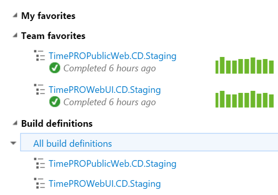

You should always follow a naming standard when naming your builds. This helps you identify their purpose at a glance.
 <excerpt class='endintro'></excerpt> 

​

The build name should have the following suffixes, depending on their purpose:
<ul><li><strong>.CI</strong> - For continuous integration builds. These are triggered automatically and do not deploy anywhere. </li><li><strong>.CD.[Environment]</strong> - For continuous delivery builds. These are triggered automatically and deploy to an environment. You should specify which environment it deploys to as well.</li></ul>
 
<dd class="ssw15-rteElement-FigureGood">Good Example: We have two continuous delivery​ builds to our staging environment.</dd>
 

