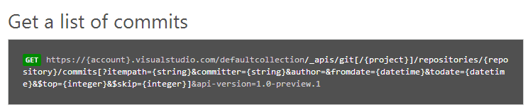
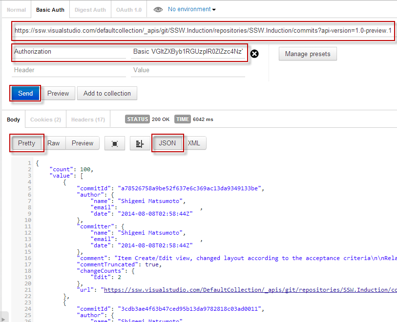

With [Visual Studio Online](http://www.visualstudio.com/) now supporting Git, more developers are changing their source control repositories. What happens if an application you developed relies on the [TFS Client Object Model](http://msdn.microsoft.com/en-us/library/bb130146.aspx) to get information out of source control (e.g. changeset comments) and the developers start using Git?

<!--endintro-->

That's where the new [Visual Studio Online REST APIs](http://www.visualstudio.com/en-us/integrate/reference/reference-vso-overview-vsi.aspx) come in. You can get a list of commits from your VSO Git repository with only a HTTP request.

Using HTTPS with basic authentication, make a GET request to a URL as below, substituting in your VSO details. A JSON object will be returned. To quickly create classes from a JSON response, see the rule [Do you know how to easily get classes from a JSON response?](/do-you-know-how-to-easily-get-classes-from-a-json-response)

For a C# implementation, see this blog post [Getting Git Commits with the VSO REST API](http://blog.damianbrady.com.au/2014/09/02/getting-git-commits-with-the-vso-rest-api/).

(This is based on [Get started with the REST APIs](http://www.visualstudio.com/en-us/integrate/get-started/get-started-rest-basics-vsi.aspx) and [VSO Integration Reference](http://www.visualstudio.com/integrate/reference/reference-vso-git-overview-vsi))
